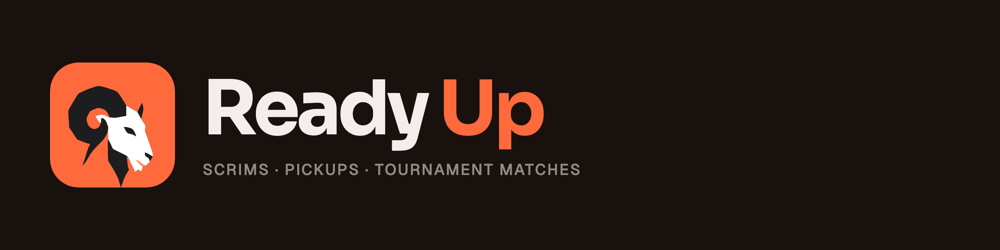

<div align="center">
  
  <p><strong>A native CS2 server plugin for scrims, pickups and tournament matches</strong></p>
  <p>
    <a href="https://github.com/Auto-Tournament/ready-up/releases/latest"></a>
    <a href="docs/CS2-COMPAT.md"></a>
    <a href="LICENSE"></a>
    <a href="https://docs.autotournament.gg"></a>
    <a href="https://discord.gg/n7gHYau7aW"></a>
  </p>
</div>

<br />

> [!CAUTION]
> **Early development.** Ready Up changes often. Expect breaking changes between releases.

Ready Up runs your CS2 server's match flow: players ready up, the match goes live, and results go back to whatever is running the event. It's part of [Auto Tournament](https://github.com/Auto-Tournament/auto-tournament) and does the same job as [MatchZy](https://github.com/shobhit-pathak/MatchZy) and [Get5](https://github.com/splewis/get5). It isn't a fork of either. We borrow their commands and event names where it makes sense, so moving over is easy.

**No Metamod. No CounterStrikeSharp. Nothing else to install.**

Ready Up is its own small ecosystem: think of it as Metamod and its plugins in one bundle. A small core loads straight into CS2 through a `gameinfo.gi` entry, the same way Metamod does, then loads Valve's real server module and passes everything through. Plugins run on top of the core and never touch the engine themselves, so a CS2 update only ever means fixing the core.

## Why it keeps working after CS2 updates

Ready Up touches the engine in as few places as it can. Every function it calls or hooks is listed in [`gamedata/engine-surface.json`](gamedata/engine-surface.json), and each one has a signature plus identity anchors: strings the function or its callers must reference. A function only resolves if the signature matches exactly once and every anchor checks out. If one breaks, just that feature turns itself off. The rest of the server keeps running.

CI checks the file against every new CS2 build, usually within minutes of the update, so we see what broke before a server does (the CS2 badge above; how it works: [docs/CS2-COMPAT.md](docs/CS2-COMPAT.md)). On a running server, `ru selftest` shows every hook, offset and feature, and ends with `PASS` or `FAIL`.

## Features

- Ready-up flow for scrims and pickups: `.r` / `.ur`, a countdown, then the match goes live on its own
- Match configs loaded from the Auto Tournament platform, with a roster whitelist and team locks
- Pauses (`.pause` / `.unpause`) and captain forfeit
- Practice mode (its own plugin): `.prac`, `.savepos`/`.loadpos`, `.spawn N`, `.rethrow`, `.bot`, `.noflash`, `.god`; a dedicated practice server with `always=1`; `.scen` replays a recorded pro round with bots ([docs/SCENARIOS.md](docs/SCENARIOS.md))
- Steam Workshop addons (its own plugin, Full bundle): the server downloads the addons listed in `cfg/ReadyUp/addons.cfg` (`workshop_addons=`) and mounts them with every map change; idle until you list one (`ru addons` shows their state)
- Deathmatch (its own plugin, Full bundle): free for all or team deathmatch with a kill / time limit, a live leaderboard, headshot only and weapon rounds (`.ru dm ffa|tdm [map]`)
- Admins, settings, crash recovery and skins loadouts in small JSON files, no database (`ru admins add|remove|list`); in fleet mode admins and loadouts come from the platform
- Per-player center-screen HTML, such as the welcome screen
- Webhooks and a heartbeat for the platform
- Knife round (in progress)

Skins (weapon paints, knives, gloves, agents) are a separate plugin and aren't in the default release. Skin changers can get a server banned, so you have to download it on purpose.

## Install

Ready Up runs on Linux dedicated servers (`linuxsteamrt64`). From your server root (the folder that contains `game/`), as the user that owns the server files:

```bash
curl -fsSL https://raw.githubusercontent.com/Auto-Tournament/ready-up/master/install.sh | bash
```

1. Pick how you use Ready Up (non-commercial is free; commercial needs a [license](docs/COMMERCIAL.md)) and type `I AGREE`.
2. Tick the components you want. Core, Match, Fleet, Practice and Essentials are on by default; Skins is off because skin changers can get servers banned.
3. Restart the server and run `ru selftest` in its console. It ends with `PASS` or `FAIL`.

Run the same command again to update or change components, and after every CS2 update (CS2 rewrites `gameinfo.gi`; the installer adds the line back). Unattended installs, beta releases, manual install from a zip and every installer flag are in [docs/INSTALL.md](docs/INSTALL.md).

With [CS2 Server Manager](https://github.com/Auto-Tournament/cs2-server-manager) you don't run the installer yourself: csm installs and updates Ready Up on every server.

## Plugins

Ready Up is a small core plus plugins. The core is the only part that touches the engine; each feature is its own plugin that you add, leave out, hot reload (`ru plugin reload <name>`) or turn off (`ru plugin disable <name>`).

| Plugin | What it does | Bundle |
|--------|--------------|--------|
| Match | Ready-up, knife round, pauses, match configs, demos, stats | Essentials |
| Essentials | Admins list and map commands | Essentials |
| Practice | Practice mode and tools, pro-round scenarios | Essentials |
| Fleet | Link to the Auto Tournament platform (idle until configured) | Essentials |
| Whitelist | Only listed players may join | Full |
| Deathmatch | Free for all and team deathmatch with a leaderboard | Full |
| Addons | Steam Workshop addons | Full |
| Midas | Fun: the best player's weapons turn gold | Full |
| Skins | Weapon paints, knives, gloves, agents | Full |
| Hello | Example plugin to start your own | Full |

Each plugin in detail, and how they talk to each other: [docs/PLUGINS.md](docs/PLUGINS.md). Running next to Metamod, CounterStrikeSharp or other match plugins: [docs/FAQ.md](docs/FAQ.md).

## Documentation

Full docs at **[docs.autotournament.gg](https://docs.autotournament.gg)**. In this repo:

- [Install and how loading works](docs/INSTALL.md)
- [Plugins](docs/PLUGINS.md) and [FAQ](docs/FAQ.md)
- [Running next to Metamod / CounterStrikeSharp](docs/COMPATIBILITY.md)
- [CS2 update checks and the badge](docs/CS2-COMPAT.md)
- [Admins](docs/ADMINS.md)
- [Deathmatch](docs/DEATHMATCH.md)
- [Esports mode (Valve ruleset) spec](docs/ESPORTS-MODE.md)
- [Development and debugging](docs/DEVELOPMENT.md)
- [Releasing](docs/RELEASING.md)

## Contributing

See the [contributing guide](.github/CONTRIBUTING.md). Questions and bug reports are welcome on [Discord](https://discord.gg/n7gHYau7aW).

## Sponsors

Ready Up is built by one person. If your organisation runs servers with it, a sponsorship pays for development and test servers: [GitHub Sponsors](https://github.com/sponsors/sivert-io) or [Ko-fi](https://ko-fi.com/sivert).

<!-- sponsors:start -->
<!-- sponsors:end -->

## Acknowledgments

- [Metamod:Source](https://github.com/alliedmodders/metamod-source): Ready Up loads into CS2 the same way, through `gameinfo.gi`
- [MatchZy](https://github.com/shobhit-pathak/MatchZy) and [Get5](https://github.com/splewis/get5): Ready Up uses their commands and event names where it makes sense

## License

Ready Up is licensed under the [PolyForm Noncommercial License 1.0.0](LICENSE). Copyright (c) 2026 Sivert Gullberg Hansen. You can use, change and share it for anything noncommercial; anyone who earns money from it needs a commercial license, see [docs/COMMERCIAL.md](docs/COMMERCIAL.md) and [pricing](https://autotournament.gg/pricing). Third-party code under `third_party/` keeps its own license.
