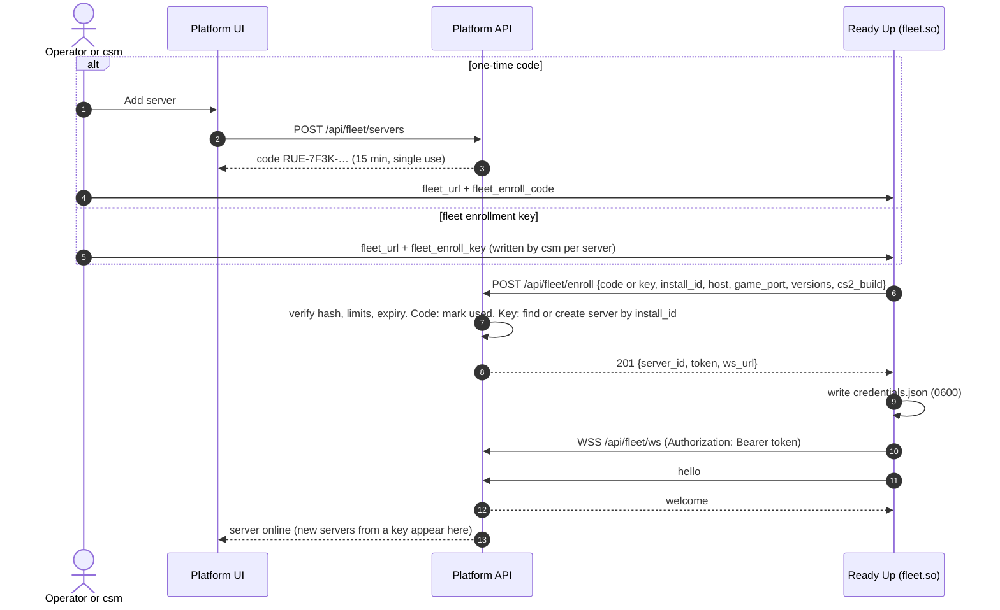
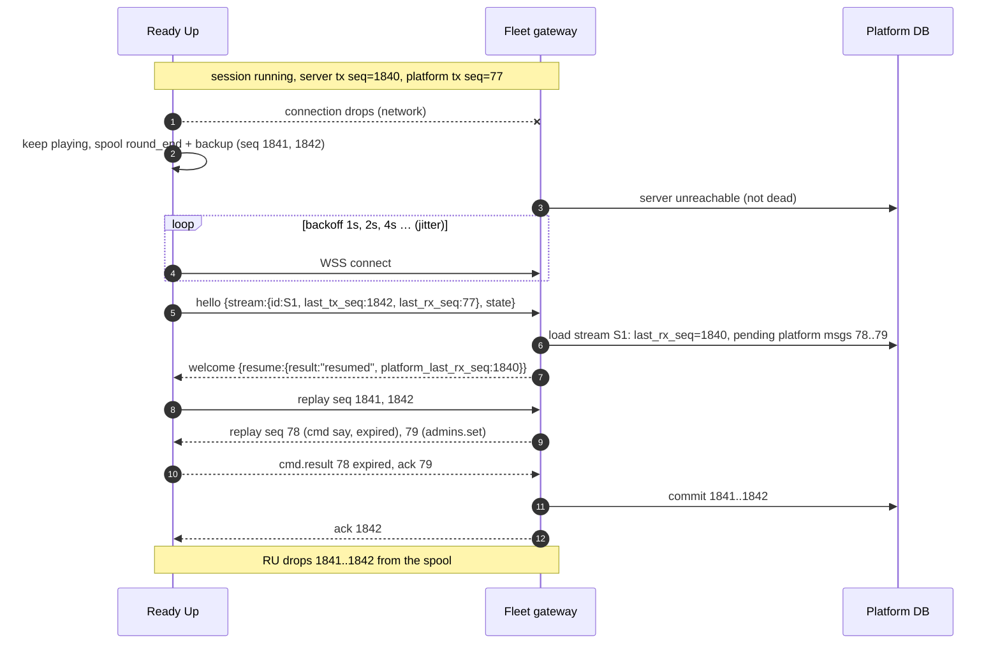
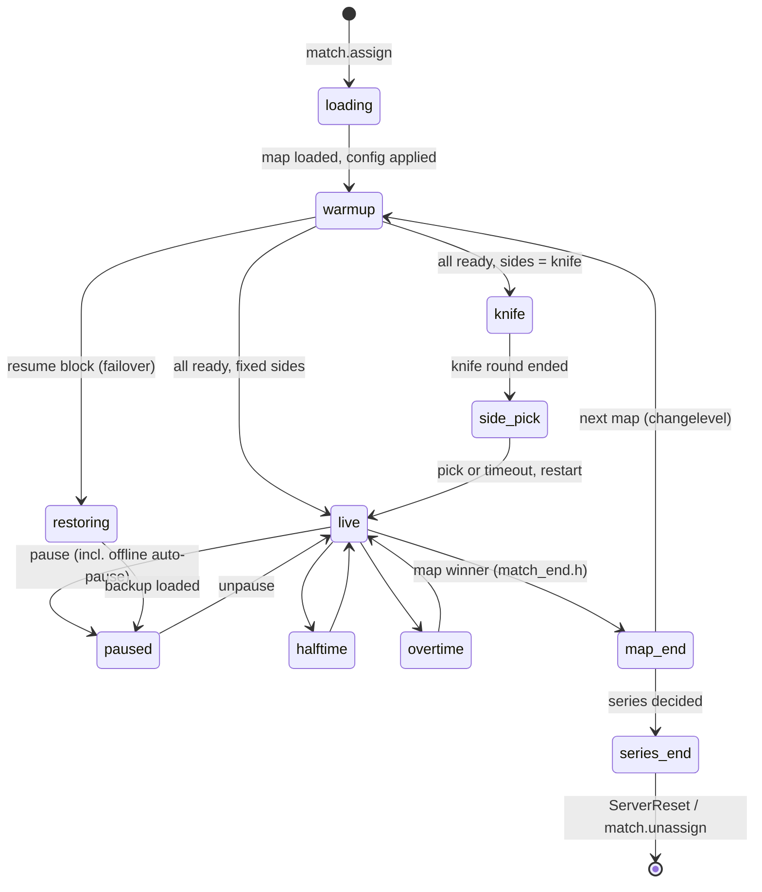
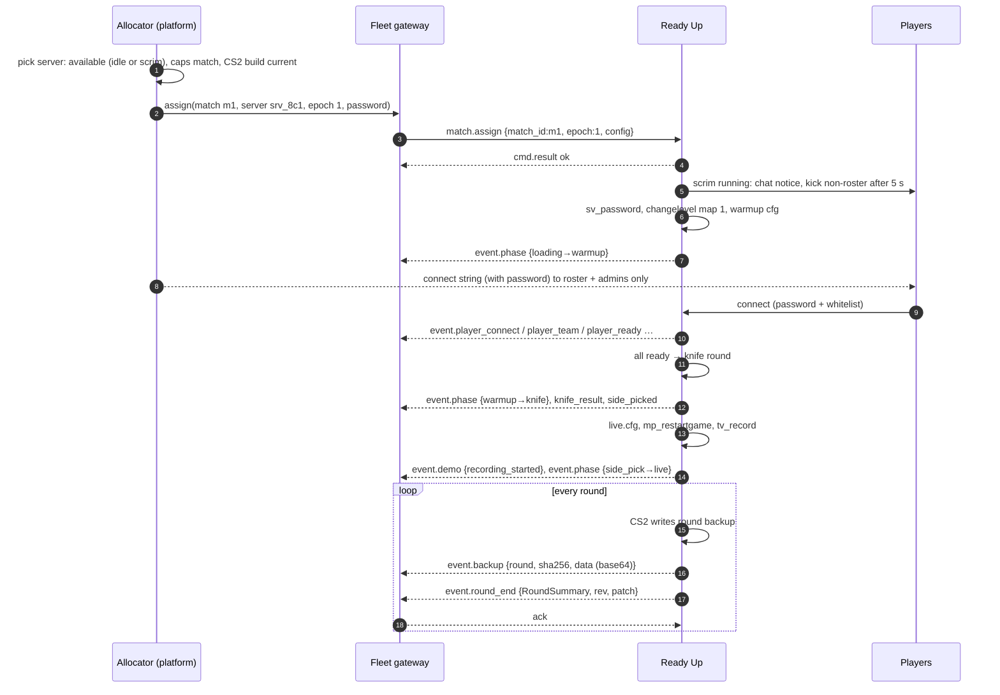
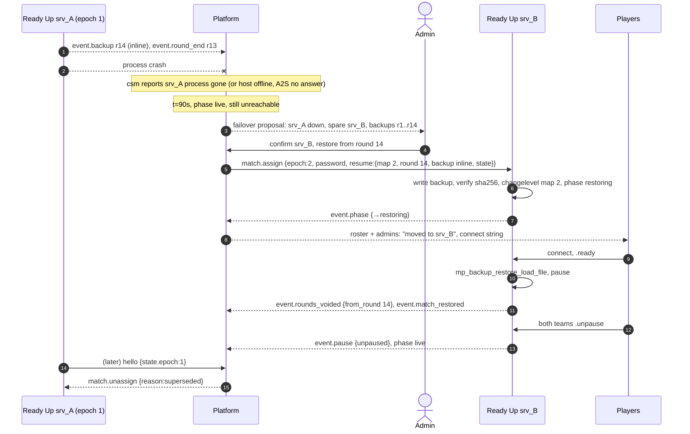
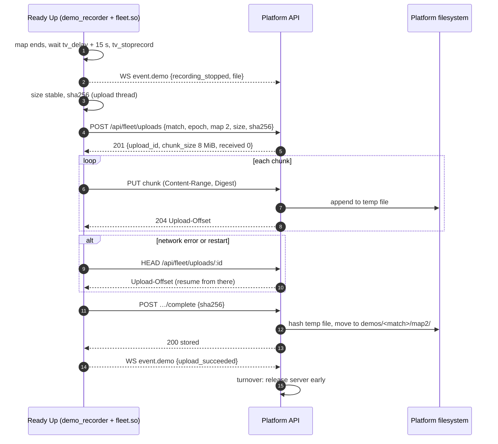
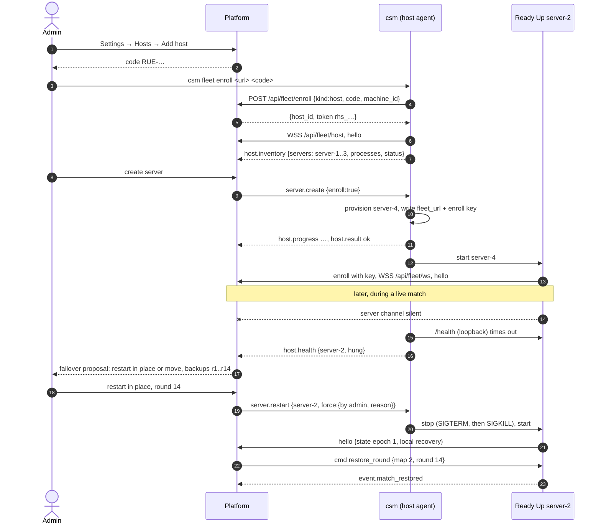

# Fleet protocol: Ready Up ↔ Auto Tournament

**Status: design, reviewed by Sivert (2026-09). Implemented on the Ready Up side so far: the local
status endpoint (§17) and build-order step 1, the `fleet.so` link (enroll, credentials, WebSocket,
seq/ack, spool, resume, offline timer); see [Implementation status](#implementation-status-ready-up).**

This document designs how Ready Up servers talk to the Auto Tournament platform ("the
platform", `Auto-Tournament/auto-tournament`). It replaces the per-server RCON + webhook
contract described in [`PARITY.md`](PARITY.md). `PARITY.md` stays useful as a **feature**
checklist (pauses, restore, forfeits, workshop maps), but its wire contract (`ru_*` cvars over
RCON, `/api/events` webhooks, bootstrap `commands[]`) is **not** what Ready Up will implement.

The server-side model the protocol carries already exists (PR #8):

| File | Owns | Carried as |
|---|---|---|
| `plugins/match/readyup/match_stats.h` | `PlayerStats`, `PlayerRound`, `RoundSummary`, `MapStats`, `StatsAccumulator` | `event.round_end.data.round` (`RoundSummary`), `event.map_result.data.stats` (`MapStats`) |
| `plugins/match/readyup/match_end.h` | map end / series end flow, `MatchFlowEvent` (`MapResult`, `SeriesEnd`, `ServerReset`), kick delays | `event.map_result`, `event.series_end`, `server.availability` |
| `plugins/match/readyup/demo_recorder.h` | per-map GOTV recording, uploader, `DemoEvent` | `event.demo`, the demo upload (§12) |

The fleet link subscribes to those listeners (`AddMatchFlowListener`, `demo::AddListener`) and
the `ToJson` serializers define the payload field names. The existing `ru_demo_*` and
`ru_series_end_kick_delay_*` console settings are set by the fleet link from `server.config`
in fleet mode, instead of by hand.

## Implementation status (Ready Up)

**Step 1 (§19.4 item 1, §19.3 item 1): `plugins/fleet` -> `csgo/readyup/plugins/fleet.so`.**

| Piece | Where |
|---|---|
| Envelope, ULID, backoff, close codes, seq/ack tracking, redaction, URL rules | `plugins/fleet/fleet_proto.*` |
| JSON (key order kept, exact int64, UTF-8 `\u` escapes) | `plugins/fleet/fleet_json.*` |
| Disk spool (outbound stream, §6.4/§6.5) | `plugins/fleet/fleet_spool.*` |
| `install_id`, `credentials.json` (0600, temp + rename) | `plugins/fleet/fleet_store.*` |
| Enrollment (HTTPS) + WebSocket session on libcurl `curl_ws_*`, network thread | `plugins/fleet/fleet_client.*` |
| ru_api glue, commands, `readyup.fleet.v1`, selftest, offline timer | `plugins/fleet/fleet_plugin.cpp` |
| Interface for other plugins | `core/include/readyup/fleet_iface.h` (the core's `/status` reads `get_status`; members after it are for plugins) |
| Plugin lines in `ru selftest` | `core/include/readyup/selftest_iface.h` (`readyup.selftest.<plugin>`) |

Config is the `[fleet]` section of `readyup.cfg` (or `csgo/cfg/ReadyUp/fleet.cfg`), read with
`config_get`: `url`, `enroll_code`, `enroll_key`, `insecure_dev`, `ca_file`, `pin_sha256`,
`offline_pause_minutes` (default 3, 0 = off), `spool_max_msgs`, `spool_max_mb`, `enabled`.
The `fleet_`-prefixed names used in this document (`fleet_url`, ...) are accepted too. No `url`
and no `credentials.json` = standalone: the plugin loads, logs one line and stays idle.

Files live in the plugin data dir `csgo/readyup/plugins/fleet/` (not `csgo/readyup/fleet/` as
§4.1 says): `install_id`, `credentials.json`, `spool/{meta.json,stream.log}`. Installers and
updaters must keep that directory.

Commands: `ru fleet status | enroll [url] <code|key> | reconnect` (console/RCON; plain `fleet ...`
works too) and `.fleet status | reconnect` / `.ru fleet ...` for admins in chat (enrolling from
chat is refused: the code would be in chat logs). The core routes an unknown `ru <cmd>` to a
plugin console command `<cmd>` and an unknown `.ru <cmd>` to a plugin chat command `.<cmd>`.

Choices made where this document leaves room:

- `state.snapshot` is sent ephemerally (only while online): after a `reset` resume, on
  `state.request`. A spooled snapshot would be stale by the time it is replayed.
- `hello.selftest` is left out (it is optional) until the core exposes its selftest result to plugins.
- `hello.versions.plugins` lists only `fleet` for now (match is still compiled into the core).
- Unknown reliable types get `error {code: "unknown_type"}` (ephemeral, `ref` = the message id)
  and are acked. Out-of-order reliable messages are dropped unacked (the platform replays them).
- A spool gap (dropped messages, torn log) starts a new stream id at the next connect, which the
  platform sees as an unknown stream -> `reset` -> snapshot. No extra hello field is needed.
- `auth.rotate` is handled inside fleet.so (new token written, `auth.rotated` spooled).
- Rejected credentials (4401/4403, HTTP 401/403): with `enroll_key` the server enrolls again
  (same `install_id`); with a one-time code it waits for `ru fleet enroll`. A refused code is not
  retried.
- Local pseudo-messages for other plugins: `local.connection` and `local.offline_timeout` (the
  D12 hook; the auto-pause itself comes with the match plugin).

Protocol: aligned with the platform's step-1 implementation (Auto-Tournament/auto-tournament
PR #386, schemas copied into `plugins/fleet/protocol/v1/`). Checked end to end against that
platform running in Docker: enroll with a one-time code, hello/welcome, pings with health,
`auth.rotate` -> `auth.rotated` and reconnect with the new token, resume after a platform
restart, and 4403 after a revoke.

Tests (`ctest`): `fleet_unit` (JSON, envelope, ULID, backoff, close codes, redaction, URLs,
seq/ack, spool, credentials), `fleet_integration` (the real client against
`plugins/fleet/tests/mock_platform.cpp`: enroll, hello/welcome, ping/pong, acks both ways,
reconnect, resume with replay, reset + snapshot, restart, heartbeat timeout, rejections, token
rotation; every frame is validated against the platform schemas),
`fleet_host` (fleet.so in the real plugin loader: standalone idle, enroll + connect, selftest,
commands, unload). `build/plugins/fleet/fleet_mock_platform --port N` runs the mock by hand.

Build: needs libcurl with WebSockets. Release builds link the static curl 8.22 from
`scripts/ci/build-static-deps.sh` (`--enable-websockets`, checked); the dev Docker image builds the
same curl into `/opt/curl-ws`. A plain `./build.sh` without such a libcurl skips fleet.so (warning)
and still builds the unit tests.

## 0. Decisions

Base decisions:

1. Servers talk **only** to the platform API, with a single server token. No DB credentials on
   game servers.
2. Each server keeps **one outbound WebSocket** to the platform and receives assignments and
   commands over it. No RCON, no bootstrap dance.
3. The server is a **worker**. Live match state streams to the platform on every change. If a
   server dies, the match resumes on another server from a round backup.

Answers to the review questions:

| # | Topic | Decision |
|---|---|---|
| D1 | Storage | **No S3/MinIO.** Demos upload to the platform API, which stores them on its filesystem. Round backups go **inline over the WebSocket** into the platform. S3 is only a possible future storage backend behind the platform's upload endpoint. Uploads use the server token, sha256 integrity, and chunked, resumable upload for large demos. |
| D2 | Enrollment | Both: a one-time code per server from the UI, and a reusable **fleet enrollment key** for csm/containers (servers self-enroll and appear in the UI). |
| D3 | Tokens | Opaque `rus_<id>_<secret>`, hashed at rest, **auto-rotated every 90 days**. |
| D4 | Tenancy | One organization per deployment. A reserved `tenant_id` field (always `"default"`) is kept on servers, tokens and stored files. |
| D5 | Admins | Platform admins only, one fleet-wide list. In-game `.ru admins` is **read-only** in fleet mode. |
| D6 | Skins | Platform feature, **opt-in per deployment** (web picker + loadouts), used only by servers with the skins plugin. |
| D7 | Failover | **Admin-confirmed.** The platform detects (90 s live / 30 s pre-live), proposes a spare server, the admin clicks. |
| D8 | Restore point | The admin **picks the round backup** from a list. Not automatically the latest. |
| D9 | Passwords | Per-match `sv_password` in `match.assign`. The connect string is shown only to the roster and admins. The whitelist is still enforced. |
| D10 | Console | `cmd.exec` exists, **root admins only, audited**. |
| D11 | Fleet code | Separate `fleet.so` plugin exposing an interface to `match` and `skins`. |
| D12 | Long disconnects | **Auto-pause** the match after N minutes offline (configurable, default 3) so admins decide. Events are buffered and replayed on reconnect. |
| D13 | Postgres | **Dropped from Ready Up entirely.** Standalone mode uses JSON files for admins, skins and recovery. |
| D14 | Status endpoint | **On by default**, bound to `127.0.0.1`, port = game port + 7, token required for non-loopback. It is how csm gets live status (§18). |
| D15 | Scaling | Single API instance for now, WS gateway in-process, with a seam for multi-instance. |
| D16 | Idle servers | Run the scrim/pickup flow. When a match is assigned: kick non-roster players with a message, then load. |
| D17 | Hosts | **The platform controls servers through csm.** CS2 Server Manager runs on each machine as a **host agent** with its own WebSocket, enrollment (code or fleet key) and host token. It starts/stops/restarts/creates servers, updates the game and Ready Up, tails logs, and reports inventory and process health (§18). It is the emergency path when Ready Up is unresponsive, and admins never need SSH. Ready Up's own per-server connection stays for match control. |
| D18 | Protocol home | Protocol types and JSON Schemas live in the **platform repo**; Ready Up CI copies them and checks its messages against them (and so does csm's CI). |

No open questions remain ([§20](#20-open-questions)).

---

## 1. Goals and non-goals

**Goals**

- Every server runs the same build for the same purpose. A server has no identity beyond
  "enrolled worker #N". Any server can take any match it has the capabilities for.
- One canonical match state object, shared by server and platform, with clear ownership per field.
- Zero per-server configuration after enrollment. Settings, admins, skins and match configs
  are pushed by the platform.
- A server crash or network loss costs at most the rounds since the backup the admin picks.
- Nothing on the connection path blocks the game thread.
- Ready Up still works with no platform at all (scrims, LAN, dev).

**Non-goals**

- Ready Up managing its own process. Starting, stopping, creating and updating servers is the
  host channel's job (csm, §18), never Ready Up's.
- Compatibility with the AT CS2 plugin's RCON/webhook contract. The platform keeps that path for
  MatchZy-fork servers during the transition (§19), but Ready Up does not speak it.
- In-game map veto. Veto stays on the platform (browser), as today.
- Object storage (S3) in v1 (D1).

## 2. What moves where

| Concern | Today (Ready Up / AT plugin) | Fleet |
|---|---|---|
| Tournament logic, brackets, scheduling | platform | platform (unchanged) |
| Map veto, side choice from veto | platform (browser) | platform (unchanged) |
| Match config (teams, rosters, maps, rules) | fetched by URL per match; AT: bootstrap + RCON cvars | platform → `match.assign` over WS |
| Server settings (chat prefix, demo, pause rules, kick delays…) | `readyup.cfg` / RCON `ru_*` per server | platform → `server.config` over WS, same for every server |
| Admins | Ready Up Postgres + MAT admins URL | platform → `admins.set` (one fleet-wide list), cached on disk |
| Skins loadouts | Ready Up Postgres tables (`skins-db-contract.md`) | platform → `skins.loadout` (opt-in, D6), cached per player |
| StatTrak counters | server writes Postgres | server reports increments, platform stores |
| Persisted match state (crash recovery) | Postgres key/value (`persisted_match_state.cpp`) | local JSON files on the server **and** the platform's state store |
| Player stats storage, aggregates, leaderboards | platform (from webhooks) | platform (from WS events, `match_stats.h` model) |
| Demos | AT: HTTP POST to platform disk | chunked HTTPS upload to the platform API → platform filesystem |
| Round backups | local disk only | local disk + inline over WS → platform |
| Server status for allocation | RCON `ru_tournament_status` poll | server pushes state; platform registry holds it |
| Live status for csm | RCON / process checks | local status endpoint `/status` + `/stream` (§17, §18) |

**Stays on the server** (timing-critical or engine-facing):

- Everything that touches the engine: hooks, events, cvars, `changelevel`, `mp_*` commands.
- Ready gating, knife round and side pick, pauses and unpause votes, halftime/overtime handling,
  round start/end detection, whitelist and team enforcement, `.gg`/`.ff`, damage tiebreak,
  the map-end/series-end flow (`match_end.h`).
- Per-round stat computation (`match_stats.h`, §13).
- Demo recording (`demo_recorder.h`), round backup writing, backup restore.
- **Local fallback when disconnected**: keep the current match going with cached config,
  admins and skins, auto-pause after N minutes (D12), buffer every outgoing message, refuse new
  assignments until reconnected (§6.6).

## 3. Components

Two channels to the platform, both outbound WebSockets:

| Channel | Runs where | Identity | Job |
|---|---|---|---|
| **Server channel** (`/api/fleet/ws`) | inside each CS2 server (`fleet.so`) | server token `rus_…` | match control: assignments, commands, state stream, backups, demo upload |
| **Host channel** (`/api/fleet/host`) | csm, one per machine | host token `rhs_…` | process control: inventory, start/stop/restart/create servers, updates, logs, health (§18) |

```
┌──────────────────────── machine (csm host agent) ───────────────────────┐
│ csm ── wss /api/fleet/host ───────────────────────────────────────────┐ │   ┌──────── platform (api/) ────────┐
│  │  start/stop/update server-N, logs, inventory                       │ │   │ Host gateway    /api/fleet/host │
│  │  reads 127.0.0.1:<port+7>  /status /stream  (process ↔ state)       └─┼──►│ Fleet gateway   /api/fleet/ws   │
│  ▼                                                                      │   │ Registry (hosts, servers, keys) │
│ ┌──────────── server-N (CS2 process) ─────────────┐                     │   │ Match state store, event log    │
│ │ core (libserver.so shim)                        │                     │   │ Round backup store              │
│ │ plugins/match.so  match flow, stats             │ wss /api/fleet/ws ──┼──►│ Failover proposals              │
│ │ plugins/skins.so  paints (optional)             │                     │   │ Upload endpoint → ArtifactStore │
│ │ plugins/fleet.so  WS client, spool, uploads,    │ https uploads ──────┼──►│ fleet normalizer → NormalizedEv.│
│ │                   status HTTP + SSE             │                     │   └─────────────────────────────────┘
│ └─────────────────────────────────────────────────┘                     │
└──────────────────────────────────────────────────────────────────────────┘
```

The two channels are independent: a hung CS2 process cannot take the host channel down, and the
platform can restart it through csm. The platform links them by `install_id` + game port, which
both report (§18.3).

**Fleet link (D11):** `plugins/fleet.so` owns the WebSocket, the spool, the demo upload,
round-backup forwarding and the status endpoint. It exposes `readyup.fleet.v1` through the
v1.1 `provide_interface`: `send_event`, `register_handler(type, fn)`, `connection_state`,
`publish_state(json)`. `match` and `skins` look it up in each callback (it can reload). This
keeps libcurl/OpenSSL out of the core (ARCHITECTURE step 5).

Threads: one network thread (libcurl `CURLOPT_CONNECT_ONLY=2` + `curl_ws_recv`/`curl_ws_send`;
WebSockets are stable since libcurl 8.11 and the bundled 8.22 has them), one upload worker, one
status-HTTP thread. Game-thread code only enqueues outbound messages into a bounded queue;
inbound messages reach plugins through `post_to_game_thread`.

## 4. Server identity and auth

### 4.1 Enrollment (D2)

Two ways in. Both end with the same per-server token.

**A. One-time code (UI).**

1. Admin clicks **Add server**. The platform creates a server record (`pending`) and shows a
   code (`RUE-7F3K-9QX2-LM4D-P8TW`, four groups of four base32 characters, single use, 15 min
   TTL, stored hashed; case- and dash-insensitive, `O`->`0`, `I`/`L`->`1`).
2. The operator sets `fleet_url` and `fleet_enroll_code` in `cfg/ReadyUp/fleet.cfg`, or runs
   `ru fleet enroll <url> <code>` in the console.

**B. Fleet enrollment key (csm, containers).**

1. Admin creates a key in **Settings → Fleet** (`rfk_<id>_<secret>`). Optional limits: max
   servers, expiry, a name prefix. Revocable; revoking it does not affect servers already enrolled.
2. csm (or the container env) writes `fleet_url` + `fleet_enroll_key` for each server it creates.
   Each server self-enrolls and appears in the UI as a new server (name from its hostname and
   `server-N` directory, editable later). A server that enrolls again with the same
   `install_id` (a random id Ready Up writes once to `csgo/readyup/fleet/install_id`) gets its
   existing record back instead of a duplicate.

In both cases the server POSTs `https://…/api/fleet/enroll` (plain HTTPS, not WS), writes
`csgo/readyup/fleet/credentials.json` (mode `0600`), stops using the code/key, and opens the
WebSocket. A key stays in the config (it is reusable); a code is removed.



### 4.2 The token (D3)

Format `rus_<token_id>_<secret>`: `token_id` = 12 base32 chars, `secret` = 256 random bits,
base64url. The platform stores `token_id`, `sha256(secret)`, `server_id`, `tenant_id`,
`created_at`, `last_used_at`, `rotated_from`, `revoked_at`. The token carries no claims; the
id prefix makes lookup an index hit, and the secret is compared by constant-time hash (as
`middleware/serverAuth.ts` does today). The token is valid for the WS upgrade and the upload
endpoint (§12), nothing else.

### 4.3 Rotation and revocation

- **Auto-rotation every 90 days** (and on demand from the UI): the platform sends
  `auth.rotate {token, old_valid_until}` over the live socket. The server writes the new file
  (temp + `rename`), then replies `auth.rotated`. Both tokens work until `old_valid_until`
  (24 h). A server offline through the whole window re-enrolls (key) or needs a new code.
- **Revocation**: mark revoked, close the socket with `4403`. On `4401`/`4403` the server caps
  its reconnect backoff at 10 min, logs `fleet: credentials rejected, re-enroll`, and keeps
  running standalone.

### 4.4 Transport security

- `wss://` and `https://` only. `ws://`/`http://` only with `fleet_insecure_dev 1` **and** a
  loopback or RFC 1918 host.
- Certificate verification always on; CA bundle from the OS, `fleet_ca_file` for private CAs,
  optional SPKI pin `fleet_pin_sha256`.
- The token goes in the `Authorization: Bearer` header only, never in URLs or message bodies.

## 5. Envelope

Every WebSocket message is one UTF-8 JSON text frame (max 1 MiB).

```json
{
  "v": 1,
  "type": "event.round_end",
  "id": "01J8ZQ4T8W6N3X0F2R5K7M9P1C",
  "seq": 1842,
  "ack": 77,
  "ts": 1790340012345,
  "ref": null,
  "epoch": 3,
  "payload": { }
}
```

```json
{
  "$schema": "https://json-schema.org/draft/2020-12/schema",
  "$id": "https://auto-tournament.dev/fleet/v1/envelope.json",
  "type": "object",
  "required": ["v", "type", "id", "ts", "payload"],
  "properties": {
    "v":       { "const": 1 },
    "type":    { "type": "string", "pattern": "^[a-z]+(\\.[a-z_]+)*$", "description": "single-word types (hello, ping, ack, error) have no dot" },
    "id":      { "type": "string", "pattern": "^[0-9A-HJKMNP-TV-Z]{26}$", "description": "ULID, unique per message" },
    "seq":     { "type": "integer", "minimum": 1, "description": "present on reliable messages only" },
    "ack":     { "type": "integer", "minimum": 0, "description": "highest contiguous peer seq received" },
    "ts":      { "type": "integer", "description": "sender clock, ms since Unix epoch" },
    "ref":     { "type": ["string", "null"], "description": "id of the message this answers" },
    "epoch":   { "type": "integer", "minimum": 1, "description": "assignment epoch, required on match-scoped messages" },
    "payload": { "type": "object" }
  },
  "additionalProperties": false
}
```

- **Reliable** messages carry `seq`. Each direction has its own sequence. The receiver acks the
  highest contiguous `seq` it has **durably** processed (platform: committed to DB; server:
  written to disk or applied). Acks piggyback, or go alone as `ack` at most 1 s / 32 messages
  after receipt.
- **Ephemeral** messages (`ping`, `pong`, `ack`, `state.request`) have no `seq` and are never replayed.
- Receivers drop duplicates by `seq` (and by `id` in a 10 000-message window).
- Unknown `type`: reliable → reply `error {code:"unknown_type"}` and ack; ephemeral → ignore.
  Unknown fields are always ignored.

Payloads below use compact TypeScript notation; `?` = optional, `u64s` = SteamID64 as a decimal
string (JSON numbers lose precision above 2^53). The normative JSON Schemas live in the platform
repo (D18) at `api/src/integrations/cs2/fleet/protocol/v1/` (server channel) and
`…/protocol/host/v1/` (host channel). Ready Up keeps a copy in `plugins/fleet/protocol/v1/`
(see its README for the source commit) and its tests validate every frame and enrollment body
`fleet.so` produces against them; csm's CI does the same for the host schemas.

## 6. Connection lifecycle

### 6.1 Connect and hello

After the upgrade, the server sends `hello` first. The platform answers `welcome` or closes.

```ts
// server → platform, ephemeral
hello {
  server_id: string, install_id: string, tenant_id: "default"
  protocol: { min: 1, max: 1 }
  versions: { core: "0.4.0", plugin_api: "1.1", plugins: { match: "0.4.0", fleet: "0.4.0", skins?: "0.4.0" },
              cs2_build: 14032, cs2_patch: "1.40.3.2" }
  capabilities: string[]                 // §14.2
  host: { hostname: string, game_port: number, tv_port?: number, public_addr?: string, status_port?: number }
  boot_id: string                        // ULID per process start
  stream: { id: string, last_tx_seq: number, last_rx_seq: number }   // §6.4
  state?: MatchState | null              // §9; null or absent when idle
  availability: "available" | "busy" | "draining" | "error"
  selftest?: { pass: boolean, passed: number, total: number, failures: string[] }   // optional
}

// platform → server, ephemeral
welcome {
  session_id: string, protocol: 1
  heartbeat: { interval_ms: 10000, timeout_ms: 30000 }
  resume: { result: "resumed" | "reset", platform_last_rx_seq: number }
  server_config_rev: number, admins_rev: number
  assignment: { match_id: string, epoch: number } | null
}
```

If `hello.state.epoch` is lower than the platform's for that match, the platform follows up
with `match.unassign {reason: "superseded"}` (§11.4). A second connection with the same
`server_id` wins; the older one is closed with `4409`.

### 6.2 Heartbeat

Both sides send `ping {t}` every `interval_ms`; the peer replies `pong {t}`. The server adds
`health: { players, tick_ms_p99, spool_msgs, uptime_s }` to its pings. Either side treats the
link as dead after `timeout_ms` without a frame and closes it. The platform then marks the
server `unreachable`, not `dead` (§11.1).

### 6.3 Reconnect with backoff

Delay = `min(cap, base · 2^attempt)` with full jitter, `base` 1 s, `cap` 30 s, reset after a
session has lasted 60 s.

| Close code | Meaning | Server behaviour |
|---|---|---|
| 1000 / 1001 | normal / platform going away | reconnect with backoff |
| 4400 | protocol error | reconnect, log the reason |
| 4401 / 4403 | bad / revoked token | cap backoff at 10 min, log loudly |
| 4409 | replaced by a newer session | wait 30 s before reconnecting |
| 4426 | protocol version unsupported | cap at 10 min; UI shows "update Ready Up" |
| 4429 | rate limited | wait `retry_after_ms` from the close reason |
| 4503 | platform draining (deploy) | reconnect, base 2 s |

### 6.4 Resume

Each side keeps an **outbound stream** of reliable messages, kept until acked.

- The server's stream lives in the spool (`csgo/readyup/fleet/spool/`) and survives a process
  restart. `stream.id` changes only when the spool is reset (new install, corrupt spool,
  `ru fleet reset`).
- The platform's stream per server is in the DB (unacked assignments and commands).

`hello.stream` carries the server's stream id, highest sent seq and the highest platform seq it
received; `welcome.resume` carries the platform's. Both replay what the other side has not
acked. If the platform does not know the stream, or the spool dropped messages (§6.5), the
result is `reset`: the platform takes the server's next `seq` as the new base (it need not be
1), the server sends a `state.snapshot` after the replay and the platform reconciles (§9.4). Platform messages with `expires_at` in the past are acked with
`cmd.result {status:"expired"}` and not executed.



### 6.5 Offline buffering limits

Spool limits: 50 000 messages or 64 MiB on disk, whichever comes first. Classes:

- **critical**: `event.round_end`, `event.backup`, `event.map_result`, `event.series_end`,
  `event.demo`, `cmd.result`, `skins.stattrak`.
- **compactable**: everything else (presence, ready, pause, phase).

When full, compactable messages are dropped oldest first. If only critical messages remain, new
compactable ones are not spooled and the stream is flagged `gap`, which forces a `reset` resume.
Round backups are the largest critical messages (≈ 80 KB each base64); a full map is about
2–3 MB, well inside the limit.

### 6.6 Behaviour while disconnected (D12, D16)

| Situation | Server does |
|---|---|
| Match live | keeps playing on cached config. After `fleet_offline_pause_minutes` (default 3) offline, it pauses at the next freeze time (`mp_pause_match`), tells players in chat ("Paused: server lost contact with the tournament platform"), and emits `event.pause {type:"offline"}` (spooled). In-game admins can unpause; the platform can unpause after reconnect. The countdown shows on `/status`. |
| Match in warmup/knife | continues normally; admin chat commands work (cached admins). No auto-pause needed before live. |
| Idle | runs the scrim/pickup flow as usual. Scrims are not reported to the platform. |
| Series ends while offline | results spool; the demo stays on disk and uploads after reconnect. |
| Server restarts while offline | local recovery from `csgo/readyup/state/*.json` (replaces the Postgres key/value), as `match_recovery.cpp` does today. |
| `ru match load` from console | refused in fleet mode unless `fleet_allow_local_matches 1`. |

## 7. Platform → server messages

All are reliable unless marked. `epoch` is required on everything match-scoped; the server
rejects a mismatch with `cmd.result {status:"rejected", error:{code:"stale_epoch"}}`.

### 7.1 `match.assign`

```ts
match.assign {
  match_id: string                 // platform match slug
  epoch: number                    // ≥ 1, bumped on every (re)assignment
  config: {
    num_maps: 1 | 2 | 3 | 5
    maps: Array<{ number: number, name: string, workshop_id?: string, sides: "team1_ct" | "team2_ct" | "knife" }>
    team1: AssignTeam, team2: AssignTeam
    spectators?: u64s[]
    admins?: u64s[]                // match-scoped admins (in addition to the fleet list)
    password: string               // sv_password for this match (D9)
    rules: rules
    cvars?: { [k: string]: string | number }   // engine cvars only (mp_*, sv_*, tv_*), never ru_*
  }
  resume?: resume                  // failover only, §11.3
}
AssignTeam { id: string, name: string, tag?: string, flag?: string, captain?: u64s,
             players: Array<{ steamid64: u64s, name: string, role?: "player" | "sub" | "coach" }> }
```

`rules` replaces today's `maxRounds`, `overtimeMode`, `knifeDecisionSeconds` and the per-match
`at_*` cvars with typed fields:

```ts
rules {
  max_rounds: 24, overtime: { enabled: true, rounds_per_half: 3, max_overtimes: -1 },
  tiebreak?: { damage: boolean, sudden_death_on_tie: boolean },
  ready: { min_per_team: 0 /* 0 = full roster */, allow_force_ready: true, autoready: false },
  knife: { side_pick_seconds: 60 },
  pause: { tactical_per_team: 4, tactical_seconds: 30, technical_per_team: 10,
           unpause: "both_teams" | "caller_team", pause_after_restore: true },
  whitelist: true, playout: false, clinch_series: true,
  forfeit: { team_absent_seconds: 240, gg_vote: { enabled: false, threshold: 0.8, min_score_diff: 8 } },
  demo: { record: true, upload: true },
  wingman: false, simulation?: { timescale: number }
}
```

Server behaviour:

1. Validate. Busy with another epoch → `rejected {code:"busy"}`. Otherwise `cmd.result ok`.
2. If a scrim or pickup game is running (D16): end it without reporting, print
   `This server was assigned a tournament match. Thanks for playing!`, and kick every connected
   player not in the roster, spectators or admins after 5 s. Rostered players stay.
3. Set `sv_password`, apply the match, `changelevel` to map 1, enter warmup.

The platform never queues a second match on a server; AT's "queued match" semantics move to the
platform.

### 7.2 `match.unassign`

```ts
match.unassign { match_id, epoch, reason: "ended" | "cancelled" | "superseded" | "moved" | "admin",
                 kick_message?: string }
```

Stops the match, clears `sv_password`, resets to idle, kicks players (after the `match_end.h`
kick delay, or at once with `kick_message`) and becomes `available`. A pending demo upload continues.

### 7.3 `match.update` (roster and rule changes mid-match)

```ts
match.update { match_id, epoch, base_config_rev: number, config_rev: number,
               ops: Array<
                 | { op: "add_player", team: "team1" | "team2" | "spectator", steamid64: u64s, name: string, role?: "player" | "sub" | "coach" }
                 | { op: "remove_player", steamid64: u64s }
                 | { op: "rename_team", team: "team1" | "team2", name: string }
                 | { op: "set_password", password: string }
                 | { op: "set_rules", rules: Partial<rules> } > }
```

Rejected with `conflict` if `base_config_rev` is not the server's `config_rev` (§9.3).

### 7.4 `cmd` (admin commands)

```ts
cmd { match_id?, epoch?, name: CmdName, args: object, issued_by: { user_id: string, name: string, root: boolean },
      expires_at: number }
```

Every command gets exactly one `cmd.result`.

| `name` | `args` | Notes |
|---|---|---|
| `pause` | `{ type: "admin" \| "technical" }` | admin pause is only unpaused by an admin or the platform |
| `unpause` | `{}` | also clears an offline auto-pause |
| `force_ready` | `{ team?: "team1" \| "team2" }` | both teams if omitted |
| `start` | `{}` | skip ready |
| `restore_round` | `{ map_number, round, backup?: InlineBackup }` | the admin picked this backup from the platform's list (D8). `backup` is sent when the server does not have the file locally |
| `restart_map` | `{}` | back to warmup on the same map; that map's stats are voided |
| `end_match` | `{ reason: string, winner?: "team1" \| "team2" }` | with `winner` = forfeit/admin result |
| `change_map` | `{ map_number }` or `{ name, workshop_id? }` | pre-live only |
| `swap_teams` | `{}` | `mp_swapteams` + keep team1/team2 mapping |
| `kick` | `{ steamid64, message? }` | |
| `say` | `{ text, as_admin?: boolean }` | max 190 bytes, control chars stripped |
| `snapshot_now` | `{}` | reliable `state.request` |
| `exec` | `{ command: string }` | **root admins only** (D10). The platform checks the web user's role and writes an audit row (user, server, match, command, time) before sending; the server rejects it unless `issued_by.root`, logs it as `fleet: exec by <user>: <command>`, runs it through `EnqueueServerCommand`, and returns captured console output (max 8 KB) in `cmd.result.output`. Single line, max 512 bytes, no `ru fleet …` (cannot change its own credentials). |

### 7.5 Server-level messages

```ts
server.config { rev: number, settings: {
  chat_prefix: string, admin_chat_prefix: string, hostname_format?: string,
  demo: { path: string, name_format: string },                    // → ru_demo_path / ru_demo_name_format
  series_end_kick_delay: { no_demo: 5, demo_no_upload: 10, demo_upload: 60 },   // match_end.h defaults
  offline_pause_minutes: 3,
  scrim_when_idle: true, scrim_knife: true,
  warmup: { message_html?: string, respawn: boolean, money: number },
  status_http?: { token?: string }                                // §17
} }

admins.set { rev: number, admins: Array<{ steamid64: u64s, name: string }> }     // one fleet-wide list (D5)

skins.loadout { steamid64: u64s, rev: number, items: {
  paints: Array<{ team: 0|2|3, defindex: number, paint: number, wear: number, seed: number, nametag?: string, stattrak?: number }>,
  knife?: Array<{ team: 0|2|3, defindex: number }>, gloves?: Array<{ team: 0|2|3, defindex: number }>,
  agents?: Array<{ team: 2|3, model: string }>, music?: number } }
skins.invalidate { steamid64: u64s }

auth.rotate { token: string, old_valid_until: number }
server.drain { reason: string }          // finish the current match, take nothing new
server.undrain {}
state.request {}                         // ephemeral, reply state.snapshot
```

- `admins.set` is the whole list and replaces the previous one; cached in
  `csgo/readyup/fleet/cache/admins.json`. In fleet mode `.ru admins` lists it; `add`/`remove`
  reply "Admins are managed on the platform" (D5).
- Skins (D6): only when the deployment has skins enabled **and** the server advertises
  `skins.v1` (the skins plugin is loaded). The platform pushes `skins.loadout` when it sees
  `event.player_connect`; the skins plugin caches it for the map.

## 8. Server → platform messages

### 8.1 Events

Every match event is reliable, carries `epoch`, and has this payload:

```ts
event.<name> { match_id: string, map_number: number, round?: number,
               rev: number,          // live_rev after this event (§9.2)
               patch: object,        // JSON Merge Patch (RFC 7386) on MatchState
               data: object }        // event facts, below
```

`patch` makes the stream a state delta; `data` holds facts that are not state. The platform
applies `patch` when `rev == stored_rev + 1`; on a gap it sends `state.request`. The same
`{rev, patch}` pairs feed the local `/stream` endpoint (§17).

| Event | `data` | Source on the server | Platform use (→ `NormalizedEvent`) |
|---|---|---|---|
| `player_connect` / `player_disconnect` | `{ steamid64, name, team?, reason? }` | core events | `presence.changed` |
| `player_team` | `{ steamid64, team, side }` | core events | live page |
| `player_ready` / `player_unready` | `{ steamid64, team, ready_team1, ready_team2, required }` | ready gate | `presence.changed` |
| `phase` | `{ from, to, reason }` | modes | `phase.changed`, `map.started`, `series.started` |
| `knife_result` | `{ winner, reason: "elimination"\|"alive"\|"hp"\|"coin" }` | knife | |
| `side_picked` | `{ team, side, picked_by: u64s \| "timeout" }` | knife | |
| `round_start` | `{ round }` | core events | |
| `round_end` | `{ round: RoundSummary, players?: PlayerLine[] }` | `match_stats.h` (`OnRoundEnd`, `ToJson(RoundSummary)`) | `score.updated`, `player.stats` |
| `backup` | `InlineBackup` (§12.3) | CS2 round backup file | backup store |
| `pause` | `{ action: "paused"\|"unpause_requested"\|"unpaused", type: "tactical"\|"technical"\|"admin"\|"offline", by, team?, duration_s? }` | pause state | `phase.changed` |
| `halftime` / `overtime` | `{ score, overtime_number? }` | modes | `phase.changed` |
| `rounds_voided` | `{ from_round, reason: "restore"\|"restart_map" }` | restore | drop stats for rounds ≥ from_round |
| `map_result` | `MatchFlowEvent` `MapResult` (`ToJson`): winner, map + series score, `stats: MapStats` | `match_end.h` | `map.result` |
| `series_end` | `MatchFlowEvent` `SeriesEnd`: winner, series score, `seconds_until_reset` | `match_end.h` | `series.ended` |
| `demo` | `DemoEvent` (`ToJson`): `recording_started`, `recording_stopped`, `upload_started`, `upload_succeeded`, `upload_failed` | `demo_recorder.h` | turnover (`utils/serverTurnover.ts`) |
| `match_restored` | `{ map_number, round, backup_sha256 }` | restore | failover confirmation |
| `forfeit` / `gg` | `{ team, reason }` | match | |
| `error` | `{ code, message, fatal }` | any | alert admins |

Server-level: `server.availability {availability, reason}` (a `ServerReset` from `match_end.h`
→ `available`), `server.cs2_update_required {required_build}`, `server.selftest {pass, failures}`.

### 8.2 Snapshot

```ts
state.snapshot { reason: "hello" | "request" | "reset" | "periodic", state: MatchState | null,
                 availability, config_rev, admins_rev, map_stats?: MapStats }
```

Sent on request, after a `reset` resume, and every 60 s while a match runs (the platform
compares and logs drift). `map_stats` is `StatsAccumulator::Current().Snapshot()`.

### 8.3 Other

```ts
cmd.result      { status: "ok" | "rejected" | "failed" | "expired", error?: { code, message }, rev?: number, output?: string }
skins.stattrak  { increments: Array<{ steamid64: u64s, defindex: number, kills: number }> }   // batched per round
auth.rotated    {}
```

## 9. Match state model

### 9.1 The canonical object

One JSON object on both sides (and on `/status`). Collections are **objects keyed by id** so a
merge patch can change one player without resending the roster.

```ts
MatchState {
  match_id: string, epoch: number, server_id: string
  config_rev: number              // platform-owned counter
  live_rev: number                // server-owned counter
  phase: "loading" | "warmup" | "knife" | "side_pick" | "live" | "paused" | "halftime"
       | "overtime" | "map_end" | "series_end" | "restoring" | "error"
  series: {
    num_maps: number, current_map: number,
    score: { team1: number, team2: number },
    maps: { [number: string]: { name: string, workshop_id?: string, sides: "team1_ct" | "team2_ct" | "knife",
            status: "pending" | "live" | "done", score: { team1, team2 }, winner?: "team1" | "team2" | "none",
            demo?: { file: string, state: "recording" | "stopped" | "uploading" | "stored" | "failed" } } }
  }
  teams: { team1: Team, team2: Team }
  spectators: { [steamid64: string]: { name: string, connected: boolean } }
  ready: { required_per_team: number, countdown_ends_at?: number }
  knife: { status: "none" | "running" | "picking" | "done", winner?: "team1" | "team2", pick_deadline?: number }
  pause: { active: boolean, type?: "tactical" | "technical" | "admin" | "offline", by?: string, started_at?: number,
           unpause: { team1: boolean, team2: boolean },
           used: { team1: { tactical: number, technical: number }, team2: { tactical: number, technical: number } } }
  round: { number: number, started_at?: number, overtime?: number }
  backups: { latest_round?: number }   // the list itself lives on the platform (§12.3)
  rules: rules
}
Team {
  id: string, name: string, tag?: string, side: "ct" | "t" | null,
  score: number, score_ct: number, score_t: number,       // MapStats TeamLine
  players: { [steamid64: string]: { name: string, role: "player" | "sub" | "coach",
             connected: boolean, ready: boolean, alive?: boolean } }
}
```

The password is not part of `MatchState` (it would leak to `/status` and the web state feed).
Per-player stats are not in it either; they travel in `round_end`/`map_result` (§13), so a 5v5
snapshot stays around 3 KB.

### 9.2 Who is authoritative

| Field | Owner | How the other side changes it |
|---|---|---|
| `match_id`, `epoch`, `server_id` | platform | `match.assign` / `match.unassign` |
| team identity, rosters, roles, spectators, `rules`, map list and sides, `num_maps` | platform (`config_rev`) | server never edits; platform sends `match.update` |
| `phase`, `round`, `knife`, `pause`, `ready`, all scores, map status/winner, `side`, player `connected/ready/alive` | server (`live_rev`) | platform sends a `cmd`, the server executes it and reports the change |
| `maps[].demo`, `backups.latest_round` | server | platform confirms storage (`demo.state = stored` after upload) |

### 9.3 Conflict rules

1. **One writer per field.** Neither side edits the other side's fields.
2. **Config changes are compare-and-set** on `config_rev`. Mismatch → `conflict` + current state;
   the platform rebuilds the update.
3. **Commands are intents.** The server decides against its current phase (`force_ready` in
   `live` → `bad_phase`); the platform shows the result.
4. **Epoch fences everything.** Messages with a lower epoch are rejected (§11.4).
5. **Results are facts.** `map_result`/`series_end` of the current epoch are final unless an
   admin overrides them on the platform, which ends the assignment (`match.unassign {reason:"admin"}`).

### 9.4 Reconcile after reset

After a `reset` resume the snapshot wins for server-owned fields. If `series.score` or finished
maps differ from what the platform stored, the platform takes the snapshot values and marks the
missing rounds' stats `incomplete` (the `map_result` `MapStats` still gives correct map totals).

### 9.5 Phase machine (server side)



## 10. Match assignment → live



## 11. Failover (D7, D8)

### 11.1 Detection

| Signal | Meaning |
|---|---|
| WS closed or no frame for 30 s | `unreachable`. Start the clock. |
| Game port A2S query (`A2S_INFO`, UDP) | answers → CS2 process is alive; no answer → gone |
| Host channel (csm, §18) | the best signal: csm reports whether the process runs, and its own read of `/health` + `/status` on loopback. "Process up, `/health` OK, WS down" = a link problem; "process gone" or "`/health` times out" = dead or hung |
| Game port A2S query (`A2S_INFO`, UDP) | fallback when the host is offline too |
| `hello` again | back. Any open proposal is withdrawn. |

After **90 s** unreachable in `live`/`paused`/`halftime`/`overtime`, or **30 s** in
`loading`/`warmup`/`knife`/`side_pick`, the platform raises a **failover proposal** on the match
page and in the admin notifications: which server is down, what the probes said, a proposed spare
server (available, same capabilities and CS2 build), and the list of stored round backups for the
current map. Nothing happens until an admin confirms.

### 11.2 The admin's choice

The proposal offers two actions: **restart the server in place** through csm (`server.restart`,
§18; the match then recovers on the same server from its local state and the backup the admin
picks) or **move to a spare server**. Restart in place is preselected when the host is online
and the process is hung; move when the host itself is gone.

The admin sees the backups the platform has for the current map (from `event.backup`), each with
round number, score at round start, time stored, and the round's events. The latest is
preselected but not forced; an admin can go back further (a disputed round, a round played while
the server was lagging). The admin can also pick a different spare server, or choose "wait" (the
proposal stays open).

Before the first backup of a map (warmup, knife, side pick) the choice is "restart this map from
warmup". A finished knife + side pick is kept: the platform fixes `maps[n].sides` from the
state, so the knife is not replayed.

### 11.3 Resume block

```ts
resume {
  from_epoch: number, map_number: number, round: number,     // chosen by the admin
  backup: InlineBackup,                                      // §12.3, the chosen file
  state: MatchState,                                         // platform's state at that round
  series_score: { team1: number, team2: number }
}
```

The new server writes the backup into `csgo/`, checks sha256, changes to the map, enters
`restoring` (whitelist + password on, wait for `rules.ready.min_per_team` per team and a ready from
both teams, or admin `force_ready`), runs `mp_backup_restore_load_file <file>`, pauses, emits
`rounds_voided {from_round: round}` and `match_restored`, and waits for unpause. The demo
continues in a new file (`…_part2.dem`); the platform keeps both.

The same flow, minus detection, is the **manual move** ("move match to another server") and,
without a server change, `cmd restore_round` on the live server.

### 11.4 Zombie fencing

The failed assignment's epoch is retired when the new one is issued. If the old server comes
back, `hello.state.epoch` is lower, and the platform replies `match.unassign {reason:"superseded",
kick_message:"Match moved to another server. Check the match page."}`. Its spooled events for the
old epoch are accepted only up to the chosen restore round (for example a `round_end` the platform
missed) and rejected after it. Its partial demo is still uploaded (`part: "pre_failover"`).

### 11.5 Player redirect

CS2 has no server-side redirect. Players get the new connect string (with the new password) on the
match page and through Discord, **shown only to the roster and admins** (D9). If the old server is
alive (manual move), it also prints "Match moved, see the match page" and kicks with that message.
It never prints the new password in chat.

### 11.6 Sequence



## 12. Uploads (D1)

### 12.1 Storage on the platform

- Demos: the platform filesystem, under the existing `DATA_DIR/demos/` (as `routes/demos.ts`
  uses today), laid out `demos/<match_id>/map<N>/<file>.dem`.
- Round backups: `DATA_DIR/backups/<match_id>/map<N>/round<RR>.txt`, indexed by a
  `match_round_backups` table (match, map, round, epoch, server, sha256, size, stored_at).
- Both go through a small `ArtifactStore` interface (`put`, `get`, `list`, `delete`) with a
  filesystem implementation. An S3 implementation can be added later behind the same interface
  without any server-side change; servers only ever talk to the platform API.
- Retention is a platform setting (default: keep demos, delete round backups 14 days after the
  series ends).

### 12.2 Demo upload: chunked and resumable over HTTPS

`demo_recorder.h` already records, waits for the GOTV flush, and uploads from its own thread with
retries. In fleet mode `fleet.so` gives it the endpoint and token, and the uploader switches from a
single request to this chunked protocol (auth: `Authorization: Bearer <server token>`):

| Request | Body | Response |
|---|---|---|
| `POST /api/fleet/uploads` | `{ kind: "demo", match_id, epoch, map_number, part?, file, size, sha256, chunk_size? }` | `201 { upload_id, chunk_size: 8388608, received: 0 }`. Idempotent on `(match_id, map_number, part, sha256)`: an existing upload is returned with its `received` offset |
| `PUT /api/fleet/uploads/:id` | one chunk, `Content-Range: bytes <from>-<to>/<size>`, `Digest: sha-256=<chunk hash, base64>` | `204`, header `Upload-Offset: <received>`. `409` + `Upload-Offset` if `from` ≠ the platform's offset |
| `HEAD /api/fleet/uploads/:id` | – | `Upload-Offset: <received>` (after a restart or error) |
| `POST /api/fleet/uploads/:id/complete` | `{ sha256 }` | `200 { stored: true }` after the platform hashed the whole file and it matches; `422` on mismatch (the upload is discarded) |

Rules: the platform checks `epoch` and that the server holds (or held) that assignment; `size`
≤ `max_demo_size` (default 2 GiB); chunks are written to a temp file and moved into place only
after the full-file sha256 matches. The server retries a failed chunk 5 times (1 s, 5 s, 15 s,
45 s, 120 s), resumes from `Upload-Offset` after a restart, and keeps trying for 24 h. It deletes
the local file only after `complete` succeeded, and then only after `demo_keep_days` (default 3).
Uploads are rate-limited while a match is live on the same server (`upload_max_kbps_live`,
default 20 000). `DemoEvent`s (`upload_started`, `upload_succeeded`, `upload_failed`) go out as
`event.demo` for turnover.

### 12.3 Round backups: inline over the WebSocket

CS2 writes a backup at each round start (`mp_backup_round_file`, 10–60 KB). The server sends it as
soon as the file is complete:

```ts
InlineBackup { map_number: number, round: number, file: string, size: number, sha256: string,
               score: { team1: number, team2: number }, encoding: "base64", data: string,
               part?: number, parts?: number }     // files > 512 KB are split into parts
```

`event.backup` is critical (spooled, replayed). The platform verifies sha256, stores the file,
and adds it to the list the admin chooses from (§11.2). The platform sends backups back the same
way (`resume.backup`, `cmd restore_round.backup`).

### 12.4 Demo upload flow



## 13. Stats

The server computes per-round stats with `StatsAccumulator` (`match_stats.h`); the platform
aggregates. Field names are the model's `ToJson` names.

| Computed on the server (`match_stats.h`) | Aggregated on the platform |
|---|---|
| `PlayerRound` per player per round: kills, assists, flash assists, damage, utility damage, HS kills, died/survived/traded, KAST, entry kill/death, MVP, clutch | series and tournament totals, leaderboards, player profiles |
| `RoundSummary`: round number, winner side/team, reason, map score after the round, team1 side | round history views, economy views later |
| `MapStats` at map end: `PlayerStats` totals (kills … `multi_kills[5]`, `clutches_won[5]`, entry kills/deaths by side, trades, `kast_rounds`, `rounds_played`, `mvp`, `score`), team `TeamLine` scores by side | ADR, KAST %, HS %, rating; check that the round sum equals the map total |

`round_end` carries the round's own values, so `rounds_voided` removes exactly its contribution.
`map_result` carries the final `MapStats`, which is the platform's source of truth for map totals.
Bots have ids in the dev-bot range (`IsDevBotId`); the platform drops them unless the match is a
simulation.

## 14. Versioning and compatibility

### 14.1 Protocol version

- `v` in the envelope is the protocol major; `hello.protocol {min, max}` offers a range and the
  platform picks the highest it supports, or closes with `4426`.
- Within a major, changes are additive: new message types, optional fields, enum values behind a
  capability. Receivers ignore what they do not know.
- The platform supports the current and previous major for at least 6 months.

### 14.2 Capabilities

`match.v1`, `restore.round`, `restore.inline`, `upload.chunked`, `stats.v1` (the `match_stats.h`
model), `pause.tactical`, `pause.offline`, `maps.workshop`, `mode.wingman`, `mode.simulation`,
`coach`, `skins.v1`, `exec`, `status_http`, `status_sse`.

The allocator only assigns matches whose requirements the server has.

### 14.3 Rolling upgrades

1. The admin starts an update from the UI (or the platform schedules one for a CS2 update).
   The platform sends `server.drain` to each affected server.
2. Each server finishes its series, reports `draining`, takes nothing new. `/status` turns
   `update_safe: true` once it is idle (§17).
3. The platform sends `host.update_plugins` (new Ready Up bundle) or `host.update_game` to csm
   (§18). csm checks `update_safe` itself and restarts only safe servers.
4. `hello` reports the new versions; the platform clears `drain` when the update was the reason.

CS2 updates reuse `cs2FleetMonitoringService` / `updateHoldService`: servers report `cs2_build` in
`hello` and `server.cs2_update_required` when Steam says they are behind.

## 15. Security

- **Tokens**: file `0600`, never logged (`rus_`/`rfk_` prefixes are redacted), never in URLs or
  match configs, shown once in the UI. The platform stores only hashes. The fleet enrollment key
  is a secret too: csm stores it in its own config with the same care.
- **Command authorization** happens on the platform (web RBAC; `exec` needs root, D10) and every
  command is written to an audit log with `issued_by`. The server still checks `match_id` +
  `epoch`, phase, argument limits, and `issued_by.root` for `exec`.
- **Passwords** (D9): generated per match (12 chars), sent only in `match.assign`/`match.update`,
  never in `MatchState`, `/status`, logs or events; shown on the web only to the roster and admins.
- **Server data is untrusted** on the platform: player names, chat, file names. Every payload is
  validated against its schema, and a server may only report on the match it is assigned to.
- **Rate limits**: platform per server 50 msg/s sustained, burst 200, 1 MiB frames, 8 MiB/min on
  the socket (backups included) → `4429`; uploads 1 concurrent upload per server; server side 20
  commands/s, `say` 1/s; enrollment 10 attempts/min per IP, code or key locked after 5 failures.
- **Replay protection**: TLS; `seq` + `id` dedupe inside and across sessions; `expires_at` on
  commands; the server rejects commands whose `ts` is more than 5 min off its clock and logs an
  NTP warning.
- **Tenant field** (D4): `tenant_id` is stored and checked (`"default"`) so a later multi-tenant
  platform does not need a protocol change.

## 16. Local and dev mode (no platform)

Fleet mode is on only when `fleet_url` is set and credentials exist. Without it Ready Up is a
standalone plugin. Postgres is gone in both modes (D13):

| Feature | Standalone source |
|---|---|
| Scrims (pickup flow, knife) | unchanged (`scrim_flow.cpp`) |
| Matches | `ru match load <file>` (local JSON in the `match.assign.config` format) or `<url>` (HTTPS GET) |
| Admins | `cfg/ReadyUp/admins.json` (SteamID64 list); `.ru admins add/remove` edits it |
| Skins | `csgo/readyup/plugins/skins/loadouts.json` (same shape as `skins.loadout`), or skins off |
| Crash recovery | `csgo/readyup/state/*.json` (replaces `persisted_match_state`'s Postgres key/value) |
| Demos | local disk; optional `ru_demo_upload_url` (the existing generic uploader in `demo_recorder.h`) |
| Round backups | local disk |
| Events | optional `ru_webhook_url` (existing sender, no platform contract) |
| Status | `/status`, `/stream` (§17), `ru state` |

Dev platform: the normal platform in dev mode. `fleet_insecure_dev 1` allows `ws://localhost`,
and the platform's `fake` integration tests can drive a fake fleet client that speaks the protocol.

## 17. Local status endpoint

A small read-only HTTP server in the **core** (`core/src/readyup/status_*`), not in `fleet.so`: it
has to work standalone, and it reports the core's own state (selftest, engine surface, loaded
plugins), which a plugin cannot see when it is not loaded or fails to load. It reads the fleet
connection state through the `readyup.fleet.v1` interface (`core/include/readyup/fleet_iface.h`)
when `fleet.so` is loaded, else reports `platform.mode: "standalone"`. It gives local tooling
(csm, uptime checks, a developer with `curl`) live state without RCON and without touching the game. **The WebSocket
stays the primary channel** to the platform; the status endpoint is secondary and nothing on the
platform depends on it. It works in standalone mode too.

### 17.1 Rules

- Its own thread. It **never** calls into the game thread or the engine.
- The game thread builds the status JSON whenever state changes (it builds the WS patch anyway)
  and publishes it by swapping a `std::shared_ptr<const std::string>` (atomic, or a mutex held only
  for the swap). The same change is appended to a small ring buffer of `{rev, patch}` for `/stream`.
  Requests only copy pointers. A slow client costs the HTTP thread, never a frame.
- GET and HEAD only; anything else → `405`.

### 17.2 Endpoints

| Path | Auth | Body |
|---|---|---|
| `GET /health` | none | `200 {"ok":true,"uptime_s":…}`, or `503` when the engine surface is disabled or the selftest failed. No match data. |
| `GET /status` | token when non-loopback | JSON below |
| `GET /stream` | token when non-loopback | Server-Sent Events (below) |
| `GET /metrics` | token when non-loopback | Prometheus text (`status_http_metrics 1`) |
| `GET /selftest` | token when non-loopback | the last selftest report (text). It does not start a selftest. |

`/status`:

```ts
{
  server_id?: string, hostname: string, game_port: number, uptime_s: number, generated_at: number,
  versions: { core, plugin_api, plugins: { match, fleet, skins? }, cs2_build, cs2_patch },
  selftest: { pass, passed, total, failures: string[], ran_at },
  platform: { mode: "fleet" | "standalone", state: "online" | "offline" | "enrolling" | "rejected" | "standalone",
              since: number,               // unix seconds reconnects: number, spool_msgs: number,
              auto_pause_in_s?: number },                        // countdown while offline in a live match (D12)
  update_safe: boolean,          // true when idle, scrim/pickup, or postgame with no demo upload pending
  summary: {                     // flat fields for a table row
    mode: "idle" | "scrim" | "match" | "practice",
    phase: string, map: string, map_number: number, num_maps: number, round: number,
    score: { team1: number, team2: number }, series_score: { team1: number, team2: number },
    players: { connected: number, expected: number },
    match_id?: string, teams?: { team1: string, team2: string }, paused?: boolean
  },
  state: MatchState | null       // same object as the WS snapshot (no password)
}
```

`update_safe` is what csm uses to hold `update-game`, `restart` and `update-plugins` during a match:
`false` in `loading`…`series_end` and while a demo upload is pending; `true` otherwise.

`/stream` (`Content-Type: text/event-stream`):

```
event: snapshot
id: 512
data: {"summary":{…},"platform":{…},"update_safe":false,"state":{…}}

event: patch
id: 513
data: {"rev":513,"patch":{"round":{"number":14},"teams":{"team1":{"score":8}}}}

event: status
data: {"platform":{"state":"offline","since":1790340000,"auto_pause_in_s":142},"update_safe":false}

: keepalive
```

- On connect: one `snapshot`. After that, `patch` events carry the same `{rev, patch}` pairs as the
  WS stream (§8.1), and `status` events carry changes to fields outside `MatchState` (platform
  connection, countdown, `update_safe`, versions after a reload).
- A `: keepalive` comment every 15 s.
- `Last-Event-ID` resumes from the ring buffer (last 256 revs); older → a fresh `snapshot`.
- At most 8 concurrent streams; a client that cannot keep up (write buffer > 256 KB) is dropped
  and reconnects.

### 17.3 Config

| Key | Default | Notes |
|---|---|---|
| `status_http_enabled` | `1` (D14) | |
| `status_http_bind` | `127.0.0.1` | |
| `status_http_port` | game port + 7 (27022 for 27015) | csm spaces servers 10 ports apart with `tv_port` = game + 5, so + 7 stays inside each server's own block (+ 50 collided with another server's game/RCON port from the 6th server on) |
| `status_http_token` | generated on first start | **required** when the bind address is not loopback (the listener refuses to start without one). Loopback requests need no token. In fleet mode the platform can set it through `server.config.status_http.token` |
| `status_http_metrics` | `0` | |

The token is a separate read-only token, **not** the fleet server token: the endpoint is plain
HTTP and the fleet token must never cross the network unencrypted. For remote access with TLS, put
a reverse proxy in front.

Discovery file: on start (and when the port or token changes) Ready Up writes
`game/csgo/readyup/status.json` (mode `0640`, owner = the CS2 user):

```json
{ "port": 27022, "bind": "127.0.0.1", "token": "rst_…", "pid": 12345, "game_port": 27015, "started_at": 1790340000 }
```

Limits: 16 concurrent connections (8 of them streams), 8 KiB request headers, 5 s read timeout on
plain requests, per-IP token bucket 5 req/s (burst 20) → `429`.

### 17.4 Implementation

| Option | Size | Pros | Cons |
|---|---|---|---|
| **Hand-rolled HTTP/1.1**, one thread, `poll()` | ~400 lines incl. SSE | no dependency; only GET/HEAD; fixed limits; easy to fuzz | we own a small parser |
| cpp-httplib (single header, MIT) | ~10k lines | mature; SSE via chunked content provider | thread per connection or pool, exceptions inside, far more surface than 5 routes |
| civetweb / mongoose (C) | medium | embeddable | mongoose is GPL/commercial; civetweb brings features we would disable |

Decision: hand-rolled (implemented).

### 17.5 As built

- **Where:** the core, not `fleet.so` (see the top of this section). Files:
  `libs/readyup/status_snapshot.*` (JSON value, RFC 7386 merge-patch diff, the `Hub` hand-off and
  event ring), `status_http.*` (request parser, responses, token check, per-IP token bucket),
  `status_server.*` (the `poll()` loop), `status_feed.*` (game-thread collector, config, discovery
  file). The match part of the snapshot (summary, MatchState, `update_safe`) comes from the match
  plugin through `readyup.match.v1` (`core/include/readyup/match_iface.h`,
  `plugins/match/readyup/match_status.cpp`); without match.so `/status` says
  `summary.match_plugin: "none"`. The first three are engine-free and covered by `tests/status_http_test.cpp` (ctest
  `status_http`, which also runs the real server on an ephemeral port).
- **Game thread cost:** the collector runs from the GameFrame hook at most every 250 ms, builds a
  `StatusInputs` tree and swaps a `shared_ptr` under a mutex that the HTTP thread only holds for
  the swap. Serializing, diffing, `rev` and the event ring all happen on the HTTP thread. Build
  time and the spacing of simulating frames are exported (`readyup_status_feed_build_us_*`,
  `readyup_game_frame_gap_ms_*_10s` in `/metrics`; `ru status_http` on the console).
- **Extras over §17.2:** `/status` has `rev`; `summary` also has `ru_mode` (the raw Ready Up mode),
  `slug`, `ready {ready,total}`, `knife`, `countdown_s` (scrim all-ready countdown) and
  `demo_uploads_pending`; `/stream` `status` events can also carry `summary`, `versions`,
  `selftest` and `healthy`; `/` lists the endpoints. `since` and `selftest.ran_at` are unix
  **seconds**; `generated_at` is unix ms.
- **Selftest:** the core runs one selftest 15 s after the first map is simulating (unless one ran
  already), so `/health` and `/status` have a result. `GET /selftest?run=1` (auth as `/selftest`,
  at most every 30 s) queues another run on the game thread and answers `202`.
- **`update_safe`:** false while a (non-scrim) match is loaded, except postgame after the series
  ended with no map-end work pending; false while a demo upload runs or when the fleet plugin says
  the platform still needs the server (`ru_fleet_status.update_blocked`).
- **Auth:** `Authorization: Bearer <token>` (what csm sends), `X-ReadyUp-Token`, or `?token=`.
  Loopback peers need none. A non-loopback bind refuses to start without a token of at least 16
  characters. The generated token (`rst_` + 48 hex) is kept in `status.json` and reused on restart.
- **Limits as implemented:** 16 connections (extra ones get `503` and are closed), 8 streams (the
  9th gets `503`), 8 KiB of headers (`431`), 5 s read timeout, 10 s write timeout for plain
  responses, 5 req/s burst 20 per IP (`429` + `Retry-After`), streams dropped above 256 KiB of
  unsent data, `Last-Event-ID` (or `?last_event_id=`) resume from the last 256 revs.
- **Env overrides:** `READYUP_STATUS_HTTP=0`, `READYUP_STATUS_HTTP_PORT=<port>`.

## 18. Hosts channel (csm) (D17)

CS2 Server Manager (`Auto-Tournament/cs2-server-manager`, Go) manages the `server-N` folders on a
machine. In fleet mode it also runs as the machine's **host agent**: one outbound WebSocket per
machine to `/api/fleet/host`. The platform uses it for everything that happens to the **process**
(inventory, start/stop/restart, create, update, logs), and Ready Up's server channel for
everything that happens **inside the match**. Admins never need SSH.

The host channel reuses the server channel's transport rules: envelope (§5, `v`, `id`, `seq`,
`ack`), hello/welcome, ping, backoff, close codes and resume (§6), and the same security rules
(§15). Only the identity and the messages differ.

### 18.1 Host enrollment and identity

- The same two paths as servers (§4.1): a one-time code from **Settings → Hosts → Add host**
  (`csm fleet enroll <url> <code>`), or the fleet enrollment key (`csm fleet enroll <url> --key
  <rfk_…>`) for scripted installs. The install wizard offers it.
- `POST /api/fleet/enroll` with `{ kind: "host", code | key, machine_id, hostname, os, csm_version }`
  → `{ host_id, token: "rhs_<id>_<secret>" }`. Stored by csm in its data dir
  (`/opt/cs2-server-manager/fleet/credentials.json`, `0600`, root only). `machine_id` comes from
  `/etc/machine-id`, so re-enrolling the same machine returns its existing record.
- Host tokens follow the server token rules: opaque, hashed, 90-day auto-rotation (`auth.rotate`),
  revocation with `4403`.
- When the host holds the fleet enrollment key, it passes it to the servers it creates, so they
  enroll themselves (D2) and appear under that host in the UI.

### 18.2 Messages

Platform → host (reliable; each gets one `host.result {status, error?, output?}` with `ref`):

```ts
host.servers.list {}                                         // reply: host.inventory
server.start    { server: "server-2", launch_mode?: "default" | "alternate" | "binary" }
server.stop     { server, grace_s?: 10 }
server.restart  { server, reason: string }
server.create   { count?: 1, name_prefix?: string, game_port?: number, enroll: boolean }   // csm provisions server-N
server.remove   { server, keep_files?: boolean }
server.set_launch_args { server, args: string[] }            // e.g. +map, -maxplayers, tickrate; ru/fleet args are csm-managed
host.update_game    { servers?: string[] }                   // SteamCMD + sync (csm update-game)
host.update_plugins { servers?: string[], readyup: { version: string, bundle: "default" | "skins" } }  // install Ready Up bundle
logs.tail  { server?: string, source: "console" | "readyup" | "csm" | "monitor", lines?: 200, follow?: boolean, max_s?: 300 }
logs.stop  { stream_id: string }
host.updates_hold { mode: "on" | "off" | "auto" }             // csm updates hold
```

Every disruptive command (`server.stop`, `server.restart`, `server.remove`, `server.set_launch_args`
when it restarts, `host.update_game`, `host.update_plugins`) carries `force?: { by: user_id, reason }`.
Without `force`, csm **refuses** it for a server whose `/status` says `update_safe: false`
(`host.result {status:"rejected", error:{code:"match_in_progress"}}`). `force` is only sent for
root admins after the platform wrote an audit row, and csm logs it too.

Host → platform:

```ts
host.inventory {                                             // on hello, on change, every 60 s
  host_id, hostname, csm_version, os,
  resources: { cpus: number, load1: number, ram_mb: number, ram_free_mb: number,
               disk: Array<{ mount: string, total_gb: number, free_gb: number }> },
  cs2: { master_build: number, update_available: boolean, updates_hold: "on" | "off" | "auto" },
  servers: Array<{
    name: "server-1", dir: string, game_port: number, tv_port?: number, status_port: number,
    process: { running: boolean, pid?: number, started_at?: number, restarts_24h: number, cpu_pct?: number, rss_mb?: number },
    readyup: { installed: string | null, install_id?: string, server_id?: string,     // from status.json + /status
               health: "ok" | "failing" | "no_response" | "not_running",
               phase?: string, update_safe?: boolean },
    cs2_build: number, launch_args: string[]
  }>
}
host.health    { server, event: "crashed" | "exited" | "hung" | "recovered" | "restarted", exit_code?, detail? }
host.result    { status: "ok" | "rejected" | "failed", error?: { code, message }, output?: string }
host.progress  { ref: string, step: string, pct?: number }   // long jobs: update-game, create
logs.chunk     { stream_id, server?, lines: string[], eof?: boolean }   // ephemeral
```

`hung` = the process runs but `/health` has not answered for 30 s. csm does **not** restart on its
own during a match; it reports and the platform decides (failover proposal, §11). When idle, csm's
existing auto-restart rules apply.

### 18.3 Correlating process and Ready Up

csm reads each server's `game/csgo/readyup/status.json` (port, token) and keeps one `/stream`
(§17) per running server. That gives it, per `server-N`, the Ready Up `install_id`/`server_id`,
phase and `update_safe`, which it puts into `host.inventory`. The platform joins host and server
records on `install_id`, so the UI shows one row per server: process state (from csm) next to
match state (from Ready Up), and a restart button that works when Ready Up does not answer.

csm's own TUI uses the same data: a live fleet table (phase, map, round, score, players
connected/expected, match and teams, platform online/offline + since, auto-pause countdown,
versions, selftest), fed by `/stream`, with `/health` for servers that do not stream. Its local
`update-game` / `restart` / `update-plugins` and the auto-update monitor wait for `update_safe`
(or skip and log why); `--force` overrides locally.

### 18.4 Enrollment and emergency restart



## 19. Migration and what the platform must build

### 19.1 Two drivers during the transition

The platform keeps the current CS2 path (RCON + webhooks: `utils/pluginRconCommands.ts`,
`services/matchLoadingService.ts`, `events/routes.ts`) for AT-plugin servers, and adds a fleet path:

- `servers.transport`: `'rcon'` (existing rows) or `'fleet'`.
- A `ServerDriver` interface in `integrations/cs2` (`loadMatch`, `endMatch`, `restart`, `command`,
  `status`, `moveMatch`). `Cs2ServerPool` (`allocation.ts`) calls the driver instead of
  `loadMatchOnServer`/RCON directly; the RCON driver wraps today's code unchanged.
- Allocation works across both pools, so a tournament can mix them during the switch.
- Fleet events go through `fleet/normalize.ts` into the **same** `NormalizedEvent` types
  (`series.started`, `map.started`, `score.updated`, `phase.changed`, `presence.changed`,
  `player.stats`, `map.result`, `series.ended`), so `core/matchLifecycle.ts` does not change.
- Once no `rcon` servers remain, the RCON driver, bootstrap, `/api/events` and the global
  `SERVER_TOKEN` can go (separate decision).

**Scaling seam (D15):** the gateway runs in the API process. All sends go through a
`FleetBus.send(serverId, msg)` interface whose v1 implementation is "look up the socket in this
process". A multi-instance version (Postgres `LISTEN/NOTIFY` or Redis routing to the instance that
holds the socket) can replace it without touching callers.

### 19.2 Platform work list

| # | Piece | Notes | Size |
|---|---|---|---|
| 1 | **Fleet WS gateway** | `ws` on the existing HTTP server at `/api/fleet/ws`; auth on upgrade; schema validation (ajv); seq/ack; outbound stream in DB; ping; close codes; `FleetBus` | L |
| 2 | **Server registry + enrollment** | tables `cs2_fleet_servers` (id, tenant_id, install_id, name, availability, versions, caps, host, last_seen), `cs2_fleet_tokens`, `cs2_fleet_enrollment_codes`, `cs2_fleet_enrollment_keys` (the CS2 module owns its tables, prefix `cs2_`); enroll endpoint; 90-day rotation job; UI: add server, keys, revoke, rotate, drain | M |
| 3 | **Match state store** | `match_live_state` (match_id, epoch, server_id, live_rev, config_rev, state json); `cs2_fleet_events` unique on (stream_id, seq); merge-patch apply; drift check | M |
| 4 | **Fleet driver + normalizer** | `match.assign` from the stored match config (`matchConfig.ts` → `config`/`rules`), per-match password, connect string visible to roster/admins only | M |
| 5 | **Uploads + artifact store** | chunked upload endpoints (§12.2), `ArtifactStore` with the filesystem backend, `match_round_backups`, demo page reading from the store, retention job | M |
| 6 | **Failover proposals** | unreachable timers, csm health + A2S fallback, restart-in-place or spare-server suggestion, backup picker UI, epoch bump, resume block; also used by "move match" and restore | M |
| 7 | **Admins, skins, exec** | fleet-wide admin list + `admins.set`; skins opt-in setting, loadout store + web picker, `skins.loadout`, StatTrak; root-only `exec` with audit log | M |
| 8 | **Turnover** | `utils/serverTurnover.ts` fed from `event.demo` + `series_end` | S |
| 9 | **Host gateway** | `/api/fleet/host` on the same transport code; `cs2_fleet_hosts` table (id, tenant_id, machine_id, name, inventory, last_seen) + host tokens; host/server join on `install_id`; UI: hosts, per-server process state, start/stop/restart/create, update game/Ready Up, live log tail; `force` + audit for disruptive actions during matches | M–L |

### 19.3 Ready Up work list

| # | Piece | Size |
|---|---|---|
| 1 | `plugins/fleet`: enroll (code + key), credentials, WS client on libcurl, envelope, seq/ack, disk spool, backoff, resume, offline auto-pause timer, `readyup.fleet.v1` interface | L |
| 2 | Match plugin: canonical `MatchState` + merge-patch emission; adapters from `MatchFlowEvent`, `DemoEvent`, `RoundSummary`/`MapStats` to events | M |
| 3 | `match.assign`/`update`/`unassign`/`cmd` handlers on top of `modes.cpp`, including scrim hand-over and `sv_password` | M |
| 4 | Local JSON persistence replacing Postgres (`persisted_match_state`, admins, skins); remove libpq | M |
| 5 | Chunked resumable demo upload in `demo_recorder`; inline round-backup forwarding; restore from an inline backup | M |
| 6 | Status endpoint: `/health`, `/status`, `/stream` (SSE), `/metrics`, `/selftest`, `status.json` | S–M |
| 7 | csm (in its repo): host agent (enroll, WS, inventory, health, command handlers, log streaming), status discovery + live TUI table, `update_safe` gating, writing `fleet_url` + enrollment key for new servers | L |

### 19.4 Order

1. Platform: registry + enrollment + gateway (hello/welcome/ping). Ready Up: `fleet.so` that
   connects and stays connected; status endpoint. csm: live table and update gating (local only).
2. Host channel: csm enrolls, reports inventory and health; start/stop/restart and log tail from the UI.
3. `match.assign` → events → normalizer; one match end to end on the fleet driver.
4. Chunked demo upload, inline round backups, turnover.
5. Restore and failover proposals (restart in place via csm, manual move, then detection).
6. Admins, skins and `exec` over the link; remove Postgres from Ready Up.
7. Create servers and update game/Ready Up from the UI through csm. Retire the RCON driver when no AT-plugin servers remain.

## 20. Open questions

None. Every review question is answered in §0 (D1–D18). New questions that come up during
implementation go here.
