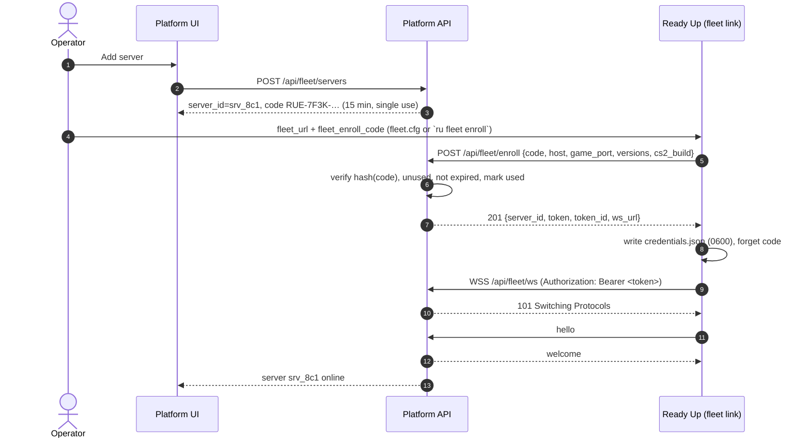
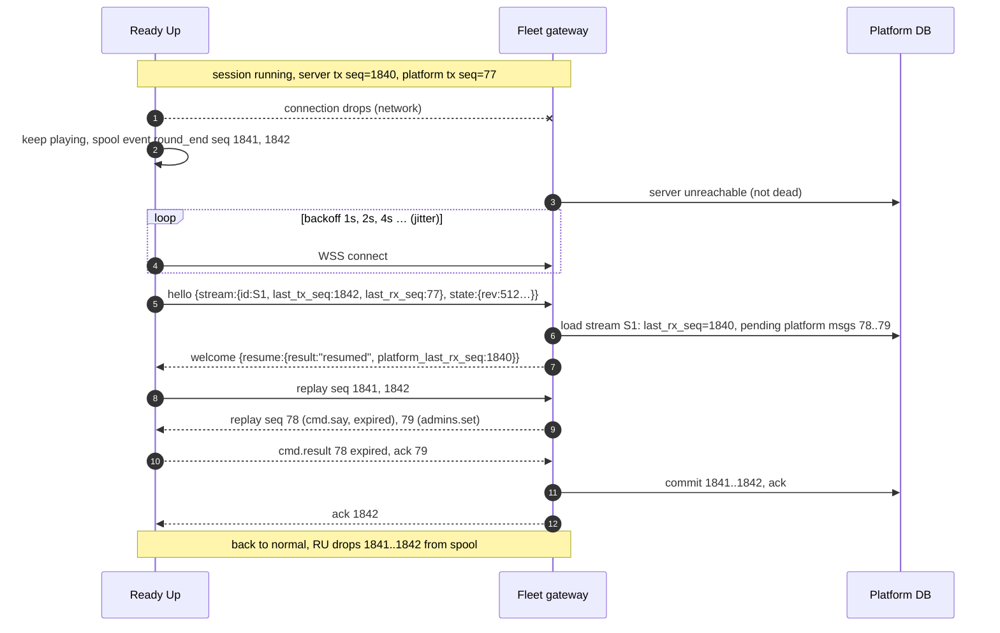
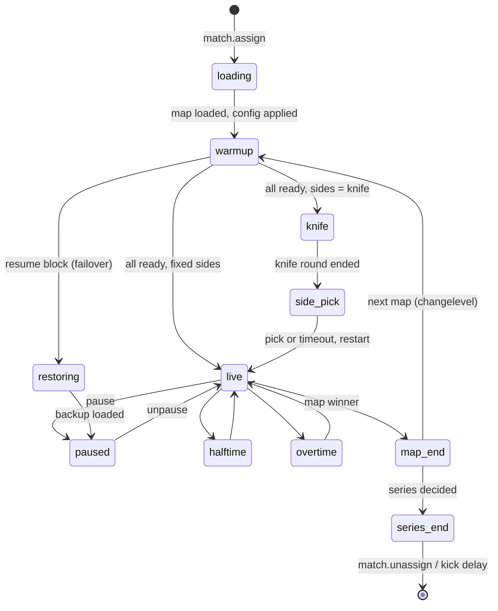
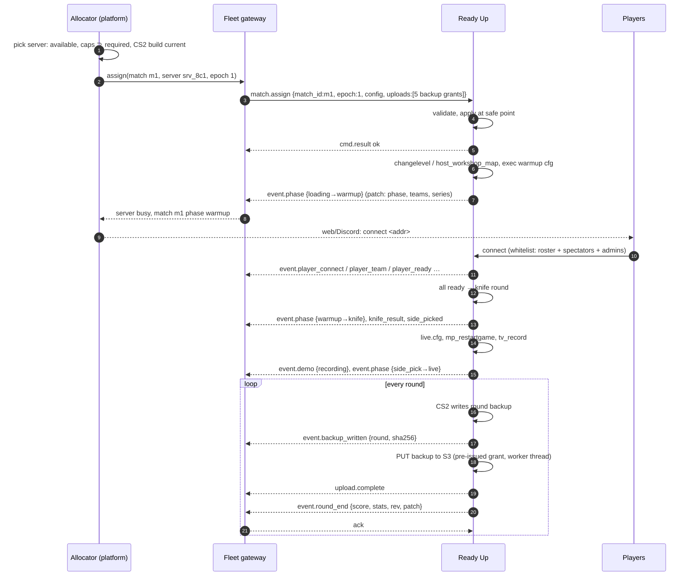
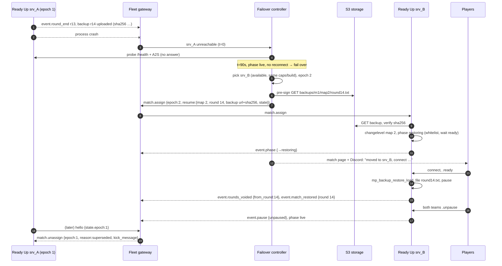
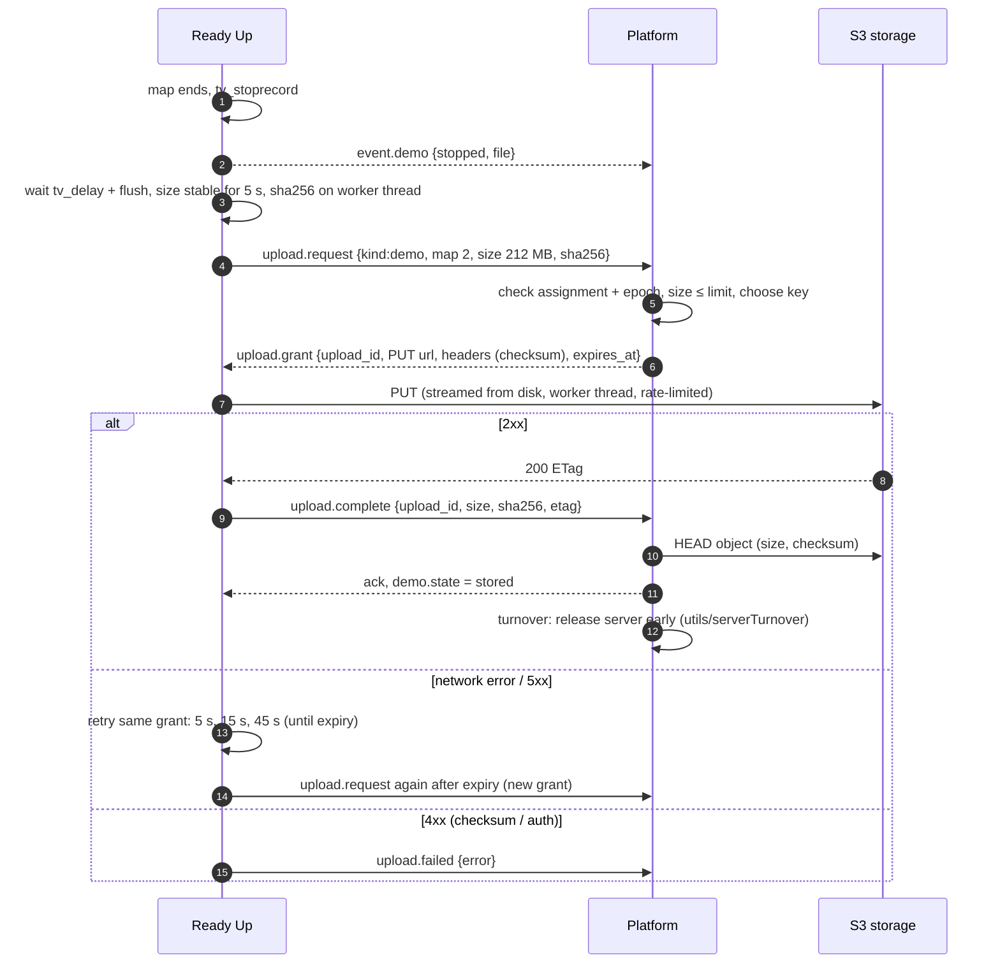

# Fleet protocol: Ready Up ↔ Auto Tournament

**Status: design draft for review. Nothing here is implemented.**

This document designs how Ready Up servers talk to the Auto Tournament platform ("the
platform", `Auto-Tournament/auto-tournament`). It replaces the per-server RCON + webhook
contract described in [`PARITY.md`](PARITY.md). `PARITY.md` stays useful as a **feature**
checklist (pauses, restore, stats, demos, forfeits), but its wire contract (`ru_*` cvars over
RCON, `/api/events` webhooks, bootstrap `commands[]`) is **not** what Ready Up will implement.

Decisions already made (Sivert, 2026-09):

1. Servers talk **only** to the platform API, with a single server token. No DB credentials on
   game servers. Ready Up's direct Postgres use (admins, skins, persisted match state) goes away.
2. Each server keeps **one outbound WebSocket** to the platform and receives assignments and
   commands over it. No RCON, no bootstrap dance.
3. The server is a **worker**. Live match state streams to the platform on every change. If a
   server dies, the match resumes on another server from the last round backup.
4. Demos and round backups go to **S3-compatible storage** through platform-issued pre-signed URLs.

Sections marked **(proposal)** are choices this draft makes that Sivert has not decided yet.
Real open questions are collected in [§19](#19-open-questions-for-sivert).

---

## 1. Goals and non-goals

**Goals**

- Every server runs the same build for the same purpose. A server has no identity beyond
  "enrolled worker #N". Any server can take any match it has the capabilities for.
- One canonical match state object, shared by server and platform, with clear ownership per field.
- Zero per-server configuration after enrollment. Settings, admins, skins and match configs
  are pushed by the platform.
- A server crash or network loss costs at most the round in progress.
- Nothing on the connection path blocks the game thread.
- Ready Up still works with no platform at all (scrims, LAN, dev).

**Non-goals**

- Server provisioning (starting/stopping CS2 processes, `csm`, Docker). The platform learns about
  servers when they connect. Provisioning can build on this later.
- Compatibility with the AT CS2 plugin's RCON/webhook contract. The platform keeps that path for
  MatchZy-fork servers during the transition (§18), but Ready Up does not speak it.
- In-game map veto. Veto stays on the platform (browser), as today.
- A generic remote console. There is no "run any command" message by default (§15, Q11).

## 2. What moves where

| Concern | Today (Ready Up / AT plugin) | Fleet |
|---|---|---|
| Tournament logic, brackets, scheduling | platform | platform (unchanged) |
| Map veto, side choice from veto | platform (browser) | platform (unchanged) |
| Match config (teams, rosters, maps, rules) | fetched by URL per match; AT: bootstrap + RCON cvars | platform → `match.assign` over WS |
| Server settings (chat prefix, demo, pause rules, kick delays…) | `readyup.cfg` / RCON `ru_*` cvars per server | platform → `server.config` over WS, same for every server |
| Admins | Ready Up Postgres + MAT admins URL | platform → `admins.set` over WS, cached on disk |
| Skins loadouts | Ready Up Postgres tables (`skins-db-contract.md`) | platform → `skins.loadout` over WS, cached per player |
| StatTrak counters | server writes Postgres | server reports increments, platform stores |
| Persisted match state (crash recovery) | Postgres key/value (`persisted_match_state.cpp`) | local files on the server **and** the platform's state store |
| Player stats storage, aggregates, leaderboards | platform (from webhooks) | platform (from WS events) |
| Demos | AT: HTTP POST to platform disk | server → S3 via pre-signed PUT |
| Round backups | local disk only | local disk + S3 via pre-signed PUT |
| Server status for allocation | RCON `ru_tournament_status` poll | server pushes state; platform registry holds it |

**Stays on the server** (timing-critical or engine-facing):

- Everything that touches the engine: hooks, events, cvars, `changelevel`, `mp_*` commands.
- Ready gating, knife round and side pick, pauses and unpause votes, halftime/overtime handling,
  round start/end detection, whitelist and team enforcement, `.gg`/`.ff`, damage tiebreak.
  These must react within a tick and must keep working while the platform is unreachable.
- Per-round stat computation from game events (§13).
- Demo recording, round backup writing, backup restore.
- **Local fallback when disconnected**: finish the current match with cached config, admins and
  skins; buffer every outgoing message; refuse new assignments until reconnected (§6.6).

## 3. Components

```
┌────────────── CS2 server ───────────────┐          ┌──────────── platform (api/) ────────────┐
│ core (libserver.so shim)                │          │ Fleet WS gateway  /api/fleet/ws         │
│ plugins/match.so   match flow           │  wss://  │ Server registry   (enroll, tokens)      │
│ plugins/skins.so   paints (optional)    │ ───────► │ Match state store (rev, event log)      │
│ fleet link: WS client, spool, uploads,  │ outbound │ Assignment/failover controller          │
│   local status HTTP (optional)          │          │ Upload grants (S3 pre-sign)             │
└─────────────────────────────────────────┘          │ fleet normalizer → NormalizedEvent      │
          │ PUT (pre-signed)                          └──────────────────┬──────────────────────┘
          ▼                                                              │
   S3-compatible storage  ◄──────────── GET (pre-signed, failover) ──────┘
```

**Fleet link placement (proposal):** a `fleet` plugin (`plugins/fleet.so`) owns the WebSocket,
the spool, uploads and the status endpoint, and exposes `readyup.fleet.v1` through the v1.1
`provide_interface`. `match` and `skins` look it up and register message handlers. That keeps
libcurl/OpenSSL out of the core (ARCHITECTURE step 5) and lets the link hot-reload. Alternative:
put it inside `match.so` (Q12).

Threads: one network thread per link (libcurl `CURLOPT_CONNECT_ONLY=2` + `curl_ws_recv`/`curl_ws_send`,
libcurl ≥ 8.11 has stable WS; the bundled 8.22 does), one upload worker, and optionally one
status-HTTP thread. Game-thread code only enqueues outbound messages into a bounded lock-free
queue; inbound messages reach plugins through `post_to_game_thread`.

## 4. Server identity and auth

### 4.1 Enrollment

An operator enrolls a server once. After that it needs nothing but its token.

1. Admin clicks **Add server** in the platform UI. The platform creates a server record in state
   `pending` and shows a one-time **enrollment code** (`RUE-7F3K-9QX2-LM4D`, 80 bits, single use,
   15 min TTL, stored hashed).
2. The operator sets two keys on the server (in `cfg/ReadyUp/fleet.cfg`, or from the console with
   `ru fleet enroll <url> <code>`):
   ```
   fleet_url          https://tournament.example.com
   fleet_enroll_code  RUE-7F3K-9QX2-LM4D
   ```
3. On start the link sees a code and no credentials. It POSTs `https://…/api/fleet/enroll`
   (plain HTTPS, not WS) with the code and a description of itself.
4. The platform checks the code, marks it used, creates the token and returns it once.
5. The server writes `csgo/readyup/fleet/credentials.json` (mode `0600`), removes the code from
   `fleet.cfg` (or ignores it from then on) and opens the WebSocket.

For container fleets, a reusable **fleet enrollment key** (many servers, one key, can be revoked)
is a possible second path (Q3).



### 4.2 The token (proposal: opaque, not JWT)

Format: `rus_<token_id>_<secret>`, with `token_id` = 12 base32 chars and `secret` = 256 random
bits, base64url. The platform stores `token_id`, `sha256(secret)`, `server_id`, tenant, scopes,
`created_at`, `last_used_at`, `revoked_at`. The token itself contains no claims.

Why opaque: revocation is immediate (delete/mark one row), there is no signing key to manage
or rotate, and the platform looks the server up on every connect anyway. The `token_id` prefix
allows an indexed lookup, and the secret is compared by constant-time hash (like
`middleware/serverAuth.ts` does today).

Scopes (fixed set, for later): `fleet:connect`, `upload:write`. The token cannot call any other
platform API.

### 4.3 Rotation and revocation

- **Rotation**: the platform sends `auth.rotate {token, old_valid_until}` over the live socket.
  The server writes the new credentials file (write temp + `rename`), then replies `auth.rotated`.
  The platform accepts both tokens until `old_valid_until` (default 24 h), then drops the old one.
  Rotation happens on a schedule (proposal: 90 days) and on demand from the UI.
- **Revocation**: the platform marks the token revoked and closes the socket with `4403`.
  On `4401`/`4403` the server stops normal reconnecting (backoff capped at 10 min), logs
  `fleet: credentials rejected, re-enroll with ru fleet enroll`, and keeps running standalone.
- **Re-enroll**: a new code for the same server record keeps `server_id` and history.

### 4.4 Transport security

- `wss://` and `https://` only. `ws://` is accepted only when `fleet_insecure_dev 1` **and** the
  host is loopback or RFC 1918.
- Certificate verification is always on. The CA bundle comes from the OS
  (`/etc/ssl/certs/ca-certificates.crt`); `fleet_ca_file` overrides it for private CAs. Optional
  SPKI pinning with `fleet_pin_sha256`.
- The token is sent in the `Authorization: Bearer` header of the upgrade request, never in the
  URL, and never inside messages.

## 5. Envelope

Every WebSocket message is one UTF-8 JSON text frame (max 1 MiB).

```json
{
  "v": 1,
  "type": "event.round_end",
  "id": "01J8ZQ4T8W6N3X0F2R5K7M9P1C",
  "seq": 1842,
  "ack": 77,
  "ts": 1790340012345,
  "ref": null,
  "epoch": 3,
  "payload": { }
}
```

```json
{
  "$schema": "https://json-schema.org/draft/2020-12/schema",
  "$id": "https://auto-tournament.dev/fleet/v1/envelope.json",
  "type": "object",
  "required": ["v", "type", "id", "ts", "payload"],
  "properties": {
    "v":       { "const": 1 },
    "type":    { "type": "string", "pattern": "^[a-z]+(\\.[a-z_]+)+$" },
    "id":      { "type": "string", "pattern": "^[0-9A-HJKMNP-TV-Z]{26}$", "description": "ULID, unique per message" },
    "seq":     { "type": "integer", "minimum": 1, "description": "present on reliable messages only" },
    "ack":     { "type": "integer", "minimum": 0, "description": "highest contiguous peer seq received" },
    "ts":      { "type": "integer", "description": "sender clock, ms since Unix epoch" },
    "ref":     { "type": ["string", "null"], "description": "id of the message this answers" },
    "epoch":   { "type": "integer", "minimum": 1, "description": "assignment epoch; required on match-scoped messages" },
    "payload": { "type": "object" }
  },
  "additionalProperties": false
}
```

- **Reliable** messages carry `seq`. Each direction has its own sequence. The receiver acks the
  highest contiguous `seq` it has **durably** processed (platform: committed to DB; server:
  written to disk or applied). Ack piggybacks on any message, or goes alone as `ack` at most 1 s
  or 32 messages after receipt.
- **Ephemeral** messages (`ping`, `pong`, `ack`, `state.request`) have no `seq` and are never replayed.
- Receivers drop duplicates by `seq` (and by `id` within a 10 000-message window).
- Unknown `type`: reliable → reply `error {code:"unknown_type"}` and ack it; ephemeral → ignore.
  Unknown fields are always ignored.

JSON Schemas for every payload live next to the platform code (proposal:
`api/src/integrations/cs2/fleet/protocol/v1/*.schema.json`, copied into
`ready-up/protocol/fleet/v1/` by CI). Below, payloads are written in compact TypeScript
notation; `?` = optional, `u64s` = SteamID64 as a decimal string (JSON numbers lose precision
above 2^53).

## 6. Connection lifecycle

### 6.1 Connect and hello

After the upgrade, the server sends `hello` first. The platform answers `welcome` or closes.

```ts
// server → platform, ephemeral
hello {
  server_id: string
  protocol: { min: 1, max: 1 }
  versions: { core: "0.4.0", plugin_api: "1.1", plugins: { match: "0.4.0", skins?: "0.4.0", fleet: "0.4.0" },
              cs2_build: 14032, cs2_patch: "1.40.3.2" }
  capabilities: string[]                 // §14.2
  host: { hostname: string, game_port: number, tv_port?: number, public_addr?: string,
          status_port?: number }         // status_port: §17
  boot_id: string                        // ULID per process start
  stream: { id: string, last_tx_seq: number, last_rx_seq: number }  // §6.4
  state: MatchState | null               // current match if any (§9); null when idle
  availability: "available" | "busy" | "draining" | "error"
  selftest: { pass: boolean, passed: number, total: number, failures: string[] }
}

// platform → server, ephemeral
welcome {
  session_id: string
  protocol: 1
  heartbeat: { interval_ms: 10000, timeout_ms: 30000 }
  resume: { result: "resumed" | "reset", platform_last_rx_seq: number }
  server_config_rev: number              // server re-requests config if its cached rev differs
  admins_rev: number
  assignment: { match_id: string, epoch: number } | null   // what the platform thinks this server runs
}
```

If `hello.state` names a match whose epoch is lower than the platform's, the platform follows
`welcome` with `match.unassign {reason: "superseded"}` (§11.4).

A second connection with the same `server_id` wins; the platform closes the older one with `4409`.

### 6.2 Heartbeat

Both sides send `ping {t}` every `interval_ms`; the other replies `pong {t}` with the same `t`.
The server includes a small health block in its ping:

```ts
ping { t: number, health?: { players: number, tick_ms_p99: number, spool_msgs: number, uptime_s: number } }
```

Either side treats the link as dead after `timeout_ms` with no frame received, and closes it.
The platform marks the server `unreachable` then, not `dead` (§11.1).

### 6.3 Reconnect with backoff

Delay = `min(cap, base · 2^attempt)` with full jitter, `base` 1 s, `cap` 30 s. Reset after a
session lasted 60 s. Close codes:

| Code | Meaning | Server behaviour |
|---|---|---|
| 1000 / 1001 | normal / platform going away | reconnect with backoff |
| 4400 | protocol error | reconnect, log the reason |
| 4401 / 4403 | bad / revoked token | cap backoff at 10 min, log loudly |
| 4409 | replaced by a newer session | do not reconnect for 30 s (avoids flapping between two processes with one identity) |
| 4426 | protocol version unsupported | cap at 10 min; the platform UI shows "update Ready Up" |
| 4429 | rate limited | wait the `retry_after_ms` from the close reason |
| 4503 | platform draining (deploy) | reconnect with backoff, base 2 s |

### 6.4 Resume

Each side keeps an **outbound stream**: reliable messages with increasing `seq`, kept until acked.

- The server's stream is persisted in the spool (`csgo/readyup/fleet/spool/`), so it survives a
  process restart. `stream.id` changes only when the spool is reset (new install, spool corrupt,
  `ru fleet reset`).
- The platform's stream per server is persisted in the DB (commands and assignments not yet acked).

On reconnect, `hello.stream` carries the server's stream id, its highest sent seq and the highest
platform seq it received. The platform answers with its own `last_rx_seq`. Both then replay
everything after the other side's `last_rx_seq`. If the platform does not know the stream id,
or the server's spool dropped messages the platform never got, `resume.result = "reset"`: the
server sends a fresh `state.snapshot` after the replay and the platform reconciles from it (§9.4).

Platform→server messages carry `expires_at` where replay would be wrong (a `say` from 10 minutes
ago). Expired messages are acked with `cmd.result {status: "expired"}` and not executed.



### 6.5 Offline buffering limits

Spool limits (proposal): 50 000 messages or 64 MiB on disk, whichever comes first. Messages are
tagged by class:

- **critical**: `event.round_end`, `event.map_result`, `event.series_end`, `event.backup_written`,
  `upload.*`, `cmd.result`, `skins.stattrak`.
- **compactable**: everything else (presence, ready, pause, phase).

When full, the spool drops compactable messages first (oldest first). If it holds only critical
messages and is still full, new compactable messages are not spooled and the stream is flagged
`gap`, which forces `resume.result = "reset"` and a snapshot on reconnect. A full spool of
critical messages means about 50 000 rounds; it is not a realistic limit.

### 6.6 Behaviour while disconnected

| Situation | Server does |
|---|---|
| Match live | keeps playing. All rules come from the cached `match.assign` + `server.config`. Events spool. |
| Match in warmup/knife | continues normally. Admin commands from chat still work (cached admins). |
| Idle | stays idle, scrim flow **off** in fleet mode unless `server.config.scrim_when_idle`. |
| Series ends while offline | results spool; demo stays on disk; upload happens after reconnect with a fresh grant. |
| Server restarts while offline | local recovery from `csgo/readyup/state/` (replaces the Postgres key/value), same as `match_recovery.cpp` today. |
| New `ru match load` from console | refused in fleet mode (the platform is the only source of matches), unless `fleet_allow_local_matches 1`. |

Whether a live match should keep going indefinitely without the platform, or pause after N
minutes, is Q13.

## 7. Platform → server messages

All are reliable unless marked. `epoch` is required on everything match-scoped; the server
rejects a mismatch with `cmd.result {status:"rejected", error:{code:"stale_epoch"}}`.

### 7.1 `match.assign`

```ts
match.assign {
  match_id: string                 // platform match slug
  epoch: number                    // ≥ 1, bumped on every (re)assignment
  config: {
    num_maps: 1 | 2 | 3 | 5
    maps: Array<{ number: number, name: string, workshop_id?: string, sides: "team1_ct" | "team2_ct" | "knife" }>
    team1: AssignTeam, team2: AssignTeam
    spectators?: u64s[]
    admins?: u64s[]                // match-scoped admins
    rules: rules                   // below
    cvars?: { [k: string]: string | number }   // engine cvars only (mp_*, sv_*, tv_*), never ru_*
    password?: string              // Q10
  }
  resume?: resume                  // failover only, §11.3
  uploads?: upload.grant[]         // pre-issued round-backup grants, §12.3
}
AssignTeam { id: string, name: string, tag?: string, flag?: string, captain?: u64s,
             players: Array<{ steamid64: u64s, name: string, role?: "player" | "sub" | "coach" }> }
```

`rules` replaces today's scattered `maxRounds`, `overtimeMode`, `knifeDecisionSeconds` and the
per-match `at_*` cvars with named, typed fields:

```ts
rules {
  max_rounds: 24, overtime: { enabled: true, rounds_per_half: 3, max_overtimes: -1 },
  tiebreak?: { damage: boolean, sudden_death_on_tie: boolean },
  ready: { min_per_team: 0 /* 0 = full roster */, allow_force_ready: true, autoready: false },
  knife: { side_pick_seconds: 60 },
  pause: { tactical_per_team: 4, tactical_seconds: 30, technical_per_team: 10,
           unpause: "both_teams" | "caller_team", pause_after_restore: true },
  whitelist: true, playout: false, clinch_series: true,
  forfeit: { team_absent_seconds: 240, gg_vote: { enabled: false, threshold: 0.8, min_score_diff: 8 } },
  demo: { record: true, upload: true },
  wingman: false, simulation?: { timescale: number }
}
```

Server behaviour: validate, reply `cmd.result {status:"ok"}` or `{status:"rejected", error}`,
then apply at a safe point (idle or postgame). A server that is busy with another epoch rejects
with `busy`. The platform never queues a second match on a server ("queued match" semantics from
AT go away: the platform holds the queue, not the server).

### 7.2 `match.unassign`

```ts
match.unassign { match_id, epoch, reason: "ended" | "cancelled" | "superseded" | "moved" | "admin",
                 kick_message?: string, keep_demo_upload?: boolean }
```

The server stops the match, resets to idle, kicks players after `server.config.series_end_kick_delay`
(or at once with `kick_message`) and becomes `available`. A pending demo upload continues
unless `keep_demo_upload:false`.

### 7.3 `match.update` (roster and rule changes mid-match)

```ts
match.update { match_id, epoch, base_config_rev: number, config_rev: number,
               ops: Array<
                 | { op: "add_player", team: "team1" | "team2" | "spectator", steamid64: u64s, name: string, role?: "player" | "sub" | "coach" }
                 | { op: "remove_player", steamid64: u64s }
                 | { op: "rename_team", team: "team1" | "team2", name: string }
                 | { op: "set_rules", rules: Partial<rules> } > }
```

Rejected with `conflict` if `base_config_rev` is not the server's current `config_rev` (§9.3).

### 7.4 `cmd` (admin commands)

One message type, named commands. Every command gets exactly one `cmd.result`.

```ts
cmd { match_id?, epoch?, name: CmdName, args: object, issued_by: { user_id: string, name: string },
      expires_at: number }
```

| `name` | `args` | Notes |
|---|---|---|
| `pause` | `{ type: "admin" \| "technical" }` | admin pause only unpaused by admin/platform |
| `unpause` | `{}` | |
| `force_ready` | `{ team?: "team1" \| "team2" }` | both teams if omitted |
| `start` | `{}` | skip ready (today `ru start` / `css_start`) |
| `restart_round` | `{}` | restore the backup of the current round's start |
| `restore_round` | `{ map_number, round }` | local file, or `backup_url` from a grant if missing locally |
| `restart_map` | `{}` | back to warmup on the same map; stats for that map are voided |
| `end_match` | `{ reason: string, winner?: "team1" \| "team2" }` | with `winner` = forfeit/admin result |
| `change_map` | `{ map_number }` or `{ name, workshop_id? }` | pre-live only |
| `swap_teams` | `{}` | `mp_swapteams` + keep team1/team2 mapping |
| `kick` | `{ steamid64, message? }` | |
| `say` | `{ text, as_admin?: boolean }` | max 190 bytes, control chars stripped |
| `snapshot_now` | `{}` | same as `state.request` but reliable |

### 7.5 Server-level messages

```ts
server.config { rev: number, settings: {
  chat_prefix: string, admin_chat_prefix: string, hostname_format?: string,
  demo: { dir: string, name_format: string },
  series_end_kick_delay: { no_demo: 10, demo_no_upload: 30, demo_upload: 150 },
  kick_when_idle: boolean, scrim_when_idle: boolean,
  warmup: { message_html?: string, respawn: boolean, money: number, ... },
  status_http?: { token: string }                               // §17
} }

admins.set { rev: number, admins: Array<{ steamid64: u64s, name: string, flags: Array<"root" | "match" | "skins"> }> }

skins.loadout { steamid64: u64s, rev: number, items: {
  paints: Array<{ team: 0|2|3, defindex: number, paint: number, wear: number, seed: number, nametag?: string, stattrak?: number }>,
  knife?: { team: 0|2|3, defindex: number }[], gloves?: { team: 0|2|3, defindex: number }[],
  agents?: { team: 2|3, model: string }[], music?: number } }
skins.invalidate { steamid64: u64s }              // player changed loadout on the web

upload.grant { ... }                              // §12
auth.rotate { token: string, old_valid_until: number }
server.drain { reason: string }                   // finish current match, then take nothing new
server.undrain {}
state.request {}                                  // ephemeral; reply state.snapshot
```

Full lists (`admins.set`, `server.config`) replace the previous one; the server caches them in
`csgo/readyup/fleet/cache/`. `skins.loadout` is pushed when a player connects (the platform sees
`event.player_connect`) and cached for the map; only servers with capability `skins.v1` get it.

## 8. Server → platform messages

### 8.1 Events

Every match event is reliable, carries `epoch`, and has this payload shape:

```ts
event.<name> { match_id: string, map_number: number, round?: number,
               rev: number,                // live_rev after this event (§9.2)
               patch: object,              // JSON Merge Patch (RFC 7386) on MatchState
               data: object }              // event-specific, below
```

The `patch` makes the stream a state delta; `data` keeps the facts that are not state (who
paused, why a round ended). The platform applies `patch` when `rev == stored_rev + 1`; a gap
means a lost message, and the platform sends `state.request`.

| Event | `data` | Platform use (→ `NormalizedEvent`) |
|---|---|---|
| `player_connect` / `player_disconnect` | `{ steamid64, name, team?, reason? }` | `presence.changed` |
| `player_team` | `{ steamid64, team: "team1"\|"team2"\|"spectator"\|"none", side: "ct"\|"t"\|null }` | live page |
| `player_ready` / `player_unready` | `{ steamid64, team, ready_team1, ready_team2, required }` | `presence.changed` |
| `team_ready` | `{ team }` | live page |
| `phase` | `{ from, to, reason }` | `phase.changed`, `map.started` (to=`live`), `series.started` |
| `knife_result` | `{ winner: "team1"\|"team2", reason: "elimination"\|"alive"\|"hp"\|"coin" }` | |
| `side_picked` | `{ team, side, picked_by: u64s \| "timeout" }` | |
| `round_start` | `{ round }` | |
| `round_end` | `{ round, reason, winner: { team, side }, duration_ms, score: { team1, team2 }, stats: RoundStats }` | `score.updated`, `player.stats` |
| `pause` | `{ action: "paused"\|"unpause_requested"\|"unpaused", type, by: u64s \| "admin" \| "platform", team?, duration_s? }` | `phase.changed` |
| `halftime` / `overtime` | `{ score, overtime_number? }` | `phase.changed` |
| `backup_written` | `{ round, file, size, sha256 }` | backup refs (§12.3) |
| `rounds_voided` | `{ from_round, reason: "restore"\|"restart_map" }` | discard stats for rounds ≥ from_round |
| `map_result` | `{ map_number, map_name, winner, score, duration_s, stats: MapStats, forfeit?: boolean }` | `map.result` |
| `series_end` | `{ winner, series_score: { team1, team2 }, forfeit?: boolean }` | `series.ended` |
| `demo` | `{ action: "recording"\|"stopped", map_number, file, size? }` | turnover |
| `match_restored` | `{ map_number, round, backup_sha256 }` | failover confirmation |
| `forfeit` / `gg` | `{ team, reason }` | |
| `error` | `{ code, message, fatal: boolean }` | alert admins |

`server.*` events (no match): `server.availability {availability, reason}`,
`server.cs2_update_required {required_build}`, `server.selftest {pass, failures}`.

### 8.2 Snapshot

```ts
state.snapshot { reason: "hello" | "request" | "reset" | "periodic", state: MatchState | null,
                 availability, config_rev, admins_rev }
```

Sent on request, after a `reset` resume, and every 60 s while a match runs (cheap insurance
against a platform bug in patch application; the platform compares and logs drift).

### 8.3 Command results and uploads

```ts
cmd.result { status: "ok" | "rejected" | "failed" | "expired", error?: { code: string, message: string },
             rev?: number }                             // ref = the command's id
upload.request  { kind: "demo" | "round_backup" | "log", match_id?, map_number?, round?, file: string,
                  size: number, sha256: string, content_type: string }
upload.complete { upload_id: string, size: number, sha256: string, etag?: string }
upload.failed   { upload_id: string, attempts: number, error: string }
skins.stattrak  { increments: Array<{ steamid64: u64s, defindex: number, kills: number }> }   // batched per round
auth.rotated    {}
```

## 9. Match state model

### 9.1 The canonical object

One JSON object, identical on both sides. Collections are **objects keyed by id** (not arrays),
so a JSON Merge Patch can change one player without resending the roster.

```ts
MatchState {
  match_id: string
  epoch: number
  server_id: string
  config_rev: number            // platform-owned counter
  live_rev: number              // server-owned counter
  phase: "loading" | "warmup" | "knife" | "side_pick" | "live" | "paused" | "halftime"
       | "overtime" | "map_end" | "series_end" | "restoring" | "error"
  series: {
    num_maps: number, current_map: number,
    score: { team1: number, team2: number },
    maps: { [number: string]: { name: string, workshop_id?: string, sides: "team1_ct" | "team2_ct" | "knife",
            status: "pending" | "live" | "done", score: { team1, team2 }, winner?: "team1" | "team2" | "draw",
            demo?: { key: string, sha256: string, state: "recording" | "uploading" | "stored" | "failed" } } }
  }
  teams: { team1: Team, team2: Team }
  spectators: { [steamid64: string]: { name: string, connected: boolean } }
  ready: { required_per_team: number, countdown_ends_at?: number }
  knife: { status: "none" | "running" | "picking" | "done", winner?: "team1" | "team2", pick_deadline?: number }
  pause: { active: boolean, type?: "tactical" | "technical" | "admin", by?: string, started_at?: number,
           unpause: { team1: boolean, team2: boolean },
           used: { team1: { tactical: number, technical: number }, team2: { tactical: number, technical: number } } }
  round: { number: number, started_at?: number, overtime?: number }
  backups: { latest?: { map_number: number, round: number, file: string, sha256: string, key?: string } }
  rules: rules                  // effective rules (§7.1)
}
Team {
  id: string, name: string, tag?: string, side: "ct" | "t" | null, score: number,
  players: { [steamid64: string]: { name: string, role: "player" | "sub" | "coach",
             connected: boolean, ready: boolean, alive?: boolean } }
}
```

Per-player stats are **not** in `MatchState`; they travel in `round_end`/`map_result` (§13),
so the state object stays small (a 5v5 snapshot is about 3 KB).

### 9.2 Who is authoritative

| Field | Owner | How the other side changes it |
|---|---|---|
| `match_id`, `epoch`, `server_id` | platform | `match.assign` / `match.unassign` |
| `teams.*.id/name/tag`, rosters (membership, role), `spectators` membership, `rules`, `series.maps[].name/sides`, `num_maps` | platform (`config_rev`) | server never edits; platform sends `match.update` |
| `phase`, `round`, `knife`, `pause`, `ready`, `series.score`, `maps[].score/status/winner`, `teams.*.score/side`, `players.*.connected/ready/alive` | server (`live_rev`) | platform sends a `cmd` (e.g. `pause`, `force_ready`), the server executes it and reports the change |
| `backups`, `maps[].demo` | server writes refs; platform confirms storage (`demo.state = stored`) | |

### 9.3 Conflict rules

1. **One writer per field.** The server increments `live_rev` for every change it makes; the
   platform increments `config_rev`. Neither side ever edits the other side's fields.
2. **Config changes are compare-and-set.** `match.update.base_config_rev` must equal the server's
   `config_rev`. On mismatch the server replies `conflict` with its current state and the
   platform rebuilds the update.
3. **Commands are intents, not writes.** A `pause` command that arrives after the server already
   unpaused just pauses again; a `force_ready` in `live` is rejected (`bad_phase`). The server
   decides; the platform shows the result.
4. **Epoch fences everything.** Messages with a lower epoch than the receiver's current one are
   rejected. This is what makes failover safe (§11.4).
5. **Results are facts.** `map_result` and `series_end` from the current epoch are final unless
   an admin overrides them on the platform. An override ends the assignment (`match.unassign
   {reason:"admin"}`); the server never "un-ends" a map.

### 9.4 Reconcile after reset

When a resume ends in `reset`, the platform receives a full snapshot. For server-owned fields
the snapshot wins. If the snapshot's `series.score` or finished maps differ from what the
platform stored (events were lost), the platform keeps the snapshot values, marks the missing
rounds' stats as `incomplete`, and asks for a demo-based re-parse later if one exists.

### 9.5 Phase machine (server side)



## 10. Match assignment → live



## 11. Failover

### 11.1 Detecting a dead server

| Signal | Meaning |
|---|---|
| WS closed or no frame for `timeout_ms` (30 s) | `unreachable`. Start the failover clock. |
| Platform probe of `http://<addr>:<status_port>/health` (§17), if reachable | alive → probably a network problem between server and platform: extend the clock once; dead/timeout → no extension |
| Game port A2S query (`A2S_INFO` over UDP) | answers → CS2 process runs; no answer → process gone |
| Reconnect with `hello` | back. Cancel failover if it has not started. |

Failover starts when the server has been unreachable for `failover_after` (proposal: 90 s during
`live`/`paused`/`halftime`; 30 s in `warmup`/`loading`, where it is just a reassignment) and the
probes do not say it is alive. Whether this is automatic or needs an admin click is Q8.

### 11.2 Restore point

The restore point is the **latest backup the platform has in storage** (`backups.latest` with a
confirmed upload). CS2 writes round backups at round start, so the resume begins at the start of
the round that was in progress, or of the next one if the round had ended. Stats for rounds from
that round on are voided (`rounds_voided`) and replayed by the new server.

Before the first backup exists (warmup, knife, side pick) the match restarts on the new server
from warmup. A finished knife + side pick is kept: the platform sets `maps[n].sides` from the
state, so the knife is not replayed.

### 11.3 Resume block in `match.assign`

```ts
resume {
  from_epoch: number,                     // the dead assignment
  map_number: number, round: number,
  backup: { url: string /* pre-signed GET, 15 min */, sha256: string, size: number, file: string },
  state: MatchState,                      // platform's last state, rev included
  series_score: { team1: number, team2: number }
}
```

The new server: downloads the backup into `csgo/` on the upload worker and checks sha256 →
changes to the map → enters `restoring` (the current recovery gate: whitelist on, wait for
`rules.ready.min_per_team` players per team and a ready from both teams, or an admin
`force_ready`) → `mp_backup_restore_load_file <file>` → pauses → `event.match_restored` →
waits for unpause. Demo recording starts a new file (`…_m2_part2.dem`); the platform stores both parts.

### 11.4 Zombie fencing

The dead assignment's epoch (e.g. 1) is retired when the new one (2) is issued. If the old server
comes back, its `hello.state.epoch` is 1, and the platform answers `match.unassign {epoch:1,
reason:"superseded", kick_message:"Match moved to <addr>"}`. Anything it spooled for epoch 1 is
accepted **only** up to the restore point (useful: a `round_end` the platform missed) and
rejected after it. The old server kicks everyone with the message and becomes available. Its
partial demo can still be uploaded (`kind: "demo", part: "pre_failover"`).

### 11.5 Player redirect

CS2 has no server-side redirect. Players learn the new address from:

- the match page (live socket update) and a Discord notification if the bot is set up;
- the old server, if it is alive but unhealthy (manual move): it prints the new `connect` line in
  chat, then kicks with it as the reason;
- a `connect` link with the server password when matches use one (Q10).

### 11.6 Sequence



## 12. Uploads

### 12.1 Object layout (proposal)

```
<bucket>/<tenant>/matches/<match_id>/map<N>/demo[-partK].dem
<bucket>/<tenant>/matches/<match_id>/map<N>/backups/round<RR>.txt
<bucket>/<tenant>/servers/<server_id>/logs/<boot_id>/<file>.log.gz
```

The key is chosen by the platform, never by the server.

### 12.2 Grant

```json
{
  "$id": "https://auto-tournament.dev/fleet/v1/upload.grant.json",
  "type": "object",
  "required": ["upload_id", "kind", "method", "url", "headers", "expires_at", "max_size"],
  "properties": {
    "upload_id":  { "type": "string" },
    "kind":       { "enum": ["demo", "round_backup", "log"] },
    "method":     { "const": "PUT" },
    "url":        { "type": "string", "format": "uri" },
    "headers":    { "type": "object", "additionalProperties": { "type": "string" },
                    "description": "must be sent verbatim, e.g. Content-Type, x-amz-checksum-sha256" },
    "expires_at": { "type": "integer" },
    "max_size":   { "type": "integer" },
    "match_id":   { "type": "string" }, "map_number": { "type": "integer" }, "round": { "type": "integer" }
  }
}
```

- The platform signs `Content-Length` and `x-amz-checksum-sha256` (base64 of the sha256 the
  server declared in `upload.request`) into the URL, so S3 rejects a body that does not match.
  Storage backends that do not support signed checksums (some MinIO/R2 setups) fall back to a
  server-side `HEAD` + size check, and the sha256 is verified on first download.
- Single PUT up to 5 GiB (the S3 limit). Demos are 50–400 MB. Multipart is not needed for v1.
- Grants expire after 15 min (demos: 60 min). An expired grant is re-requested, not retried.

### 12.3 Round backups

Round backups are 10–60 KB and one arrives every round, so a request/grant round trip per round
is wasteful. The platform pre-issues 5 `round_backup` grants in `match.assign` and sends a new one
each time the server reports `upload.complete`. If the server runs out (platform unreachable),
backups stay on disk and are uploaded later; failover then uses an older backup (Q2 considers
sending backups inline over the WS instead).

### 12.4 Demo upload flow



Retries: up to 5 attempts per grant, then a new grant, for up to 24 h. Local files are deleted
only after the platform acks `upload.complete`, and then only after `demo_keep_days` (default 3).
Uploads never run on the game thread and are bandwidth-limited while a match is live on the same
server (`upload_max_kbps_live`, default 20 000).

## 13. Stats

| Computed on the server (per round, from game events) | Aggregated on the platform |
|---|---|
| kills, deaths, assists, flash assists, headshot kills, team kills, suicides, knife kills | per-map and per-series totals (from `map_result`, checked against the round sum) |
| damage, utility damage, enemies/friendlies flashed | ADR, KAST %, rating, HS % |
| bomb plants/defuses, first kill/death per side, trade kills (≤ 5 s) | leaderboards, player profiles, tournament stats |
| multikills (1k–5k), clutches (1v1–1v5), MVP, in-game score | per-team economy/round history views |
| KAST flag per round (kill, assist, survived, traded) | stat corrections after `rounds_voided` |

`RoundStats` in `round_end` carries **the round's values** per player (not cumulative), so a
voided round removes exactly its contribution. `MapStats` in `map_result` carries the map totals
so the platform can verify its sum. Same field names as PARITY §8, `snake_case`. The platform
maps them onto its existing `player.stats` normalized event.

## 14. Versioning and compatibility

### 14.1 Protocol version

- `v` in the envelope is the protocol **major**. `hello.protocol {min, max}` offers a range; the
  platform picks the highest it supports, or closes with `4426`.
- Within a major, changes are additive: new message types, new optional fields, new enum values
  behind a capability. Receivers ignore what they do not know (§5).
- The platform supports the current and the previous major for at least 6 months, so servers can
  update at their own pace.

### 14.2 Capabilities

Servers advertise what they can do; the allocator only assigns matches whose requirements are a
subset. Initial set:

`match.v1`, `restore.round`, `restore.remote` (download a backup URL), `upload.s3_put`,
`upload.s3_checksum`, `stats.full` (the PARITY §8 set), `pause.tactical`, `maps.workshop`,
`mode.wingman`, `mode.simulation`, `coach`, `skins.v1`, `status_http`.

### 14.3 Rolling upgrades

1. Admin (or CI) marks a server `drain` → `server.drain`.
2. The server finishes its series, reports `availability: draining`, takes no new match.
3. Operator updates Ready Up (or CS2) and restarts the process.
4. `hello` reports new versions and capabilities; the platform clears `drain` automatically if
   the upgrade was the reason.

CS2 updates reuse the existing `cs2FleetMonitoringService` / `updateHoldService` logic: servers
report `cs2_build` in `hello` and `server.cs2_update_required` when Steam says they are behind.

## 15. Security

- **Token handling**: file `0600`, never logged (log redaction of `rus_` prefixes), never in URLs
  or match configs, never shown back in the UI after enrollment. Platform stores only the hash.
- **Command authorization** happens on the platform: a `cmd` is only sent after the platform's
  RBAC check on the web user, and `issued_by` is recorded in the audit log. The server trusts the
  authenticated socket, but still checks every command against the match (`match_id` + `epoch`),
  the phase, and argument limits. There is no free-form console command (Q11).
- **Server-originated data is untrusted** on the platform: player names, chat, file names. The
  platform validates every payload against the JSON Schema, and checks that a server only reports
  on the match it is assigned to.
- **Rate limits**:
  - platform per server: 50 messages/s sustained, burst 200, 1 MiB frame, 8 MiB/min; above that
    close `4429`.
  - server per session: 20 commands/s; `say` 1/s.
  - enrollment: 10 attempts/min per IP, codes locked after 5 failures.
- **Replay protection**: TLS gives integrity; `seq` + `id` de-duplication stops replays inside a
  session and across resumes; commands carry `expires_at`; the server rejects commands with `ts`
  more than 5 min from its clock (logged, with an NTP warning).
- **Pre-signed URLs**: one object, one method, short TTL, signed size and checksum. Download URLs
  (failover) are issued only to the server that holds the new assignment.
- **Tenant isolation**: every server, token and object key is scoped to a tenant (if multi-tenant,
  Q5).

## 16. Local and dev mode (no platform)

Fleet mode is on only when `fleet_url` is set and credentials exist. Without it Ready Up is a
standalone plugin, as today:

| Feature | Standalone source |
|---|---|
| Scrims (pickup flow, knife) | unchanged (`scrim_flow.cpp`) |
| Matches | `ru match load <file>` (local JSON in the `match.assign.config` format) or `<url>` (plain HTTPS GET, for MAT-like tools) |
| Admins | `cfg/ReadyUp/admins.json` (list of SteamID64s + flags); `.ru admins add/remove` edits it |
| Skins | `csgo/readyup/plugins/skins/loadouts.json`, or skins off |
| Crash recovery | `csgo/readyup/state/` files (replaces the Postgres key/value) |
| Demos / backups | local disk only |
| Events | optional `ru_webhook_url` (existing sender, no platform contract), or none |
| Status | local status endpoint (§17), `ru state` |

Postgres support is removed from Ready Up entirely in both modes (Q14). A **dev platform** is
just the normal platform in dev mode: `fleet_insecure_dev 1` allows `ws://localhost`, and the
platform's `fake` integration tests can drive a fake fleet client that speaks the same protocol.

## 17. Local status endpoint (optional, secondary channel)

A small read-only HTTP server inside Ready Up, so local tooling (csm, uptime checks, a developer
with `curl`) and, when reachable, the platform can read the latest state without RCON and
without touching the game. **The WebSocket stays the primary channel**: it is outbound, NAT
friendly and pushes on change. The status endpoint is pull-only, off by default (Q15), and
nothing depends on it.

### 17.1 Rules

- Runs on its own thread. It **never** calls into the game thread or the engine, and takes no
  lock that the game thread holds for more than a pointer swap.
- The game thread (fleet link) builds the status JSON whenever state changes, as it already does
  for the WS patch, and publishes it by swapping a `std::shared_ptr<const std::string>`
  (`std::atomic<std::shared_ptr<…>>`, or a mutex held only for the swap). Requests copy the
  pointer and write the bytes. A slow client costs the HTTP thread, never a frame.
- GET and HEAD only. Anything else → `405`.

### 17.2 Endpoints

| Path | Auth | Body |
|---|---|---|
| `GET /health` | none | `200 {"ok":true,"uptime_s":…}`, or `503` when the engine surface is disabled / selftest failed. Liveness only, no match data. |
| `GET /status` | token when non-loopback | `{ server_id, versions, cs2_build, uptime_s, availability, fleet: { connected, session_id, last_connect_at, spool_msgs, reconnects }, selftest: { pass, passed, total, failures }, state: MatchState \| null, generated_at }`, the same `MatchState` as `state.snapshot` |
| `GET /metrics` | token when non-loopback | Prometheus text (optional, `status_http_metrics 1`): `readyup_fleet_connected`, `readyup_fleet_spool_messages`, `readyup_players_connected`, `readyup_match_round`, `readyup_tick_ms{quantile}`, `readyup_uploads_pending`, `readyup_build_info{core,match,cs2}` |
| `GET /selftest` | token when non-loopback | the last selftest report (text), as stored at the last run. It does **not** start a selftest; that needs the game thread. |

### 17.3 Config

| Key | Default | Notes |
|---|---|---|
| `status_http_enabled` | `0` | |
| `status_http_bind` | `127.0.0.1` | `0.0.0.0` or a specific address to expose it |
| `status_http_port` | `game port + 50` (27065 for 27015) | proposal; any free port |
| `status_http_token` | empty | **required** when the bind address is not loopback; the server refuses to start the listener otherwise. In fleet mode the platform can supply it in `server.config.status_http.token` |
| `status_http_metrics` | `0` | |

Auth is `Authorization: Bearer <status token>`. It is a **separate, read-only token**, not the
fleet server token: the endpoint is plain HTTP, and the fleet token must never cross the network
unencrypted. For TLS, put a reverse proxy in front.

Limits: max 16 concurrent connections, 8 KiB request headers, 5 s read timeout,
`Connection: close`, per-IP token bucket 5 req/s (burst 20) → `429`.

### 17.4 Uses

- csm / local scripts: server list with live score, players, phase, "connected to platform?".
- Uptime monitoring: `/health`.
- Debugging: `curl localhost:27065/status | jq` instead of `ru state` over RCON.
- Platform fallback probe during failover detection (§11.1): only if the address is reachable
  from the platform (`hello.host.status_port` + `public_addr`). Helps tell "server alive, link
  broken" from "server dead".

### 17.5 Implementation options (no heavy deps)

| Option | Size | Pros | Cons |
|---|---|---|---|
| **Hand-rolled HTTP/1.1** on one thread with `poll()` | ~300 lines | no dependency; exactly GET/HEAD, fixed limits; easy to audit and fuzz | we own the parser (small, but ours) |
| **cpp-httplib** (single header, MIT) | ~10k lines header | mature, simple API, handles keep-alive and edge cases | thread per connection or pool, uses exceptions internally, much more surface than 4 GET routes |
| civetweb / mongoose (C) | medium | embeddable, battle-tested | mongoose is GPL or commercial; civetweb brings features we would disable |

Recommendation: hand-rolled. Four read-only routes with `Connection: close` do not need a
framework, and the request parser can be covered by a fuzz test in `tools/`.

## 18. Migration and what the platform must build

### 18.1 Two drivers during the transition

The platform keeps the current CS2 path (RCON + webhooks, `utils/pluginRconCommands.ts`,
`services/matchLoadingService.ts`, `events/routes.ts`) for AT-plugin servers, and adds a fleet
path for Ready Up servers. Proposal:

- `servers.transport`: `'rcon'` (default for existing rows) or `'fleet'`.
- A `ServerDriver` interface inside `integrations/cs2` with `loadMatch`, `endMatch`, `restart`,
  `command`, `status`, `moveMatch`. `Cs2ServerPool` (`allocation.ts`) calls the driver instead
  of `loadMatchOnServer`/RCON directly. The RCON driver wraps today's code unchanged.
- Allocation works across both pools. A tournament can mix them during the switch.
- Fleet events go through a new `fleet/normalize.ts` into the **same** `NormalizedEvent` types
  (`series.started`, `map.started`, `score.updated`, `phase.changed`, `presence.changed`,
  `player.stats`, `map.result`, `series.ended`), so `core/matchLifecycle.ts` and everything
  downstream do not change.
- Once no `rcon` servers remain, the RCON driver, bootstrap, `/api/events` webhook route and the
  global `SERVER_TOKEN` can be removed (separate decision).

### 18.2 Platform work list

| # | Piece | Notes | Size |
|---|---|---|---|
| 1 | **Fleet WS gateway** | `ws` on the existing HTTP server at `/api/fleet/ws`; auth on upgrade; envelope validation (JSON Schema, e.g. ajv); seq/ack; spool of outbound reliable messages in DB; ping; close codes | L |
| 2 | **Server registry** | tables `fleet_servers` (id, tenant, name, status, availability, versions, caps, host, last_seen), `fleet_tokens` (token_id, hash, server_id, revoked_at), `fleet_enrollment_codes`, `fleet_sessions`; enroll endpoint; UI: add server, code, revoke, rotate, drain | M |
| 3 | **Match state store** | `match_live_state` (match_id, epoch, server_id, live_rev, config_rev, state jsonb); `fleet_events` (server_id, stream_id, seq, epoch, type, payload) unique on (stream_id, seq); merge-patch apply; drift check on snapshot | M |
| 4 | **Fleet driver + normalizer** | `ServerDriver` for fleet; `match.assign` built from the stored match config (`matchConfig.ts` → `config`/`rules` mapping); normalizer to `NormalizedEvent` | M |
| 5 | **S3 grants** | `@aws-sdk/client-s3` + `s3-request-presigner`; settings: endpoint, region, bucket, credentials, path-style; checksum signing; `HEAD` verification; demos page reads from S3 (pre-signed GET for downloads); retention job | M |
| 6 | **Failover controller** | unreachable timer, probes (A2S, optional `/health`), epoch bump, resume block, notifications; manual "move match" reuses it | M |
| 7 | **Admins & skins APIs** | admins model + `admins.set` push on change; skins loadout store + web picker (already planned against `skins-db-contract.md`) → `skins.loadout` push; StatTrak increments | M |
| 8 | **Turnover** | `utils/serverTurnover.ts` fed from `event.demo` + `upload.complete` instead of demo webhooks | S |
| 9 | Optional: **status probe** | call `/health` of unreachable servers when `status_port` is known | S |

### 18.3 Ready Up work list

| # | Piece | Size |
|---|---|---|
| 1 | Fleet link: enroll, credentials, WS client on libcurl, envelope, seq/ack, disk spool, backoff, resume | L |
| 2 | Canonical `MatchState` builder + merge-patch emission from the match plugin (replaces `WebhookEmit*`) | M |
| 3 | `match.assign`/`match.update`/`cmd` handlers (maps onto existing `modes.cpp` entry points) | M |
| 4 | Local file persistence replacing Postgres (`persisted_match_state`, admins, skins cache); remove libpq | M |
| 5 | Upload worker (pre-signed PUT, sha256, retries, bandwidth cap), round-backup grant pool | M |
| 6 | Restore from remote backup (resume block) on top of `match_recovery.cpp` | M |
| 7 | Full stat set (PARITY §8) as per-round `RoundStats` | M |
| 8 | Optional: local status endpoint (§17) | S |

The feature items from PARITY (pause types, `.forceready`, restore by round, forfeits, workshop
maps, team names) are still needed; they are now driven by `rules` and `cmd` instead of cvars.

### 18.4 Order

1. Platform: registry + enrollment + gateway (hello/welcome/ping only). Ready Up: link that
   connects and stays connected. Servers show up in the UI as online.
2. `match.assign` → events → normalizer; one match end to end on the fleet driver, no uploads.
3. S3 grants, demos, round backups; turnover.
4. Failover (manual move first, then automatic).
5. Admins/skins over the link; remove Postgres from Ready Up.
6. Optional status endpoint; retire the RCON driver when no AT-plugin servers remain.

## 19. Open questions for Sivert

1. **Storage.** Which S3-compatible storage is the default for self-hosters: bundle MinIO in the
   platform's compose file, require the operator to bring one (R2, B2, AWS), or keep a
   local-disk fallback on the platform when no S3 is configured? And how long are demos and
   round backups kept?
2. **Round backups: S3 or inline?** Backups are 10–60 KB. Sending them inline over the WS (stored
   by the platform in its DB or storage) would make failover work without S3 and without grants.
   Keep S3 for everything (decision 4), or inline for backups and S3 for demos?
3. **Enrollment UX.** One-time code per server from the UI only, or also a reusable fleet
   enrollment key for containers/autoscaling (servers enroll themselves and appear in the UI)?
4. **Token format.** OK with opaque tokens (hashed in the DB, instant revocation), or do you want
   signed JWTs? Rotation period (90 days proposed)?
5. **Multi-tenant.** Will one platform instance serve several organizations with separate fleets
   (tenant id on servers, tokens, objects), or is it one organization per deployment? Can a
   server ever be shared between tenants?
6. **Admins.** Who is an in-game admin: platform admins only, per-tournament admins, per-server
   admins, or all of these (flags in `admins.set`)? Should `.ru admins add/remove` in game still
   exist in fleet mode (write through to the platform) or be read-only there?
7. **Skins.** Are skins a platform feature at all (web picker, per-user loadouts), given the GSLT
   ban risk? Per tenant / per tournament toggle? Who owns StatTrak counts?
8. **Failover policy.** Automatic, or admin-confirmed ("server X is down, move match to Y?")?
   Timeouts: 90 s live / 30 s pre-live OK? Only during live, or also warmup?
9. **Restore point.** Losing the round in progress is the cost of restoring from the round-start
   backup. Acceptable? Should the platform warn admins before a restore that changes the score?
10. **Player redirect and passwords.** How do players learn the new server: match page + Discord
    is proposed. Should fleet matches set a per-match `sv_password` (sent in `match.assign`) and
    show it only to rostered players?
11. **Console escape hatch.** Should the platform be able to send an arbitrary console command
    (`cmd.exec`, root admins only, audited)? Useful for emergencies, but it is exactly the RCON
    surface this design removes.
12. **Where the fleet link lives.** Separate `fleet.so` plugin exposing an interface to `match` and
    `skins` (proposed), or inside `match.so`?
13. **Long disconnects.** If a live server loses the platform for a long time, keep playing to the
    end and reconcile later (proposed), or auto-pause after N minutes so admins can decide?
14. **Postgres in standalone mode.** OK to drop Postgres from Ready Up completely (standalone uses
    JSON files for admins, skins and recovery state), including for people who run it without the
    platform today?
15. **Status endpoint defaults.** Off by default with `127.0.0.1` and `game port + 50`, as
    proposed? Should the platform push a status token by default so its fallback probe works?
16. **Scope of "server".** Is a fleet server always one CS2 process, and does the platform stay out
    of provisioning (starting/stopping processes, csm) for now?
17. **Platform scaling.** The API runs as one instance today. Is that the plan for a while (the WS
    gateway can live in-process), or should the design assume several API instances now (needs
    Postgres `LISTEN/NOTIFY` or Redis to route commands to the instance holding a server's socket)?
18. **Idle servers.** In fleet mode, should an idle server run the scrim/pickup flow for whoever
    joins (`scrim_when_idle`), or kick everyone who is not an admin?
19. **Protocol home.** Should the JSON Schemas live in the platform repo (proposed, copied into
    ready-up by CI), in ready-up, or in a small shared `fleet-protocol` repo?
